Depiction
=========

2D layout, SVG rendering, the style that controls both, and the overlay system that puts numbers on a
structure.

Three things are separate on purpose, and knowing which one you are calling answers most questions on
this page:

* **layout** decides where the atoms go, and only ``clean2d()`` stores its answer;
* **drawing** turns a molecule plus a layout into a ``Scene``, and stores nothing at all;
* a **style** is an immutable value passed to the drawing call, so two pictures in one process can
  differ.

Drawing
-------

.. testcode::

    from chython import smiles

    mol = smiles('c1ccccc1O')

    # A whole SVG document, as a str.  2D coordinates are computed if the molecule has none
    svg = mol.depict()

    # The Scene behind it: geometry without a document, and the other serializations
    scene = mol.scene()
    svg = scene.to_svg()
    svgz = scene.to_svgz()   # gzip-compressed bytes, which is what a .svgz file is

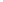

   ``smiles('c1ccccc1O').depict()`` at the default style.

Carbons are unlabelled, heteroatoms wear the CPK colour, and an aromatic ring gets a dashed inner line
rather than alternating double bonds -- all three are style defaults and all three are changeable.

Reactions draw as one figure, with the arrow and the ``+`` signs belonging to the drawing rather than to
any molecule:

.. testcode::

    rxn = smiles('CC(=O)O.OCC>>CC(=O)OCC.O')
    svg = rxn.depict()

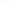

   Reactants, arrow, products, and one ``+`` per gap within a side.  Every molecule is drawn to one
   scale and the furniture is sized by the ``reaction`` style branch, so the arrow does not change
   length with the molecules beside it.

**Nothing is cached**, here or in ``chython.depict``.  A cached picture is a picture at one style, so a
second style would silently be served the first one's output.

In a Jupyter notebook a molecule or reaction renders by itself, through ``_repr_svg_``, at the process
default style -- a notebook cell states none.

Every drawing entry point takes an optional ``log=`` list, which is where a picture reports what it had
to decide for itself:

.. testcode::

    log = []
    unplaced = smiles('CCO')          # parsed from SMILES, so it carries no coordinates
    svg = unplaced.depict(log=log)
    print(log[0].rule)
    print(unplaced.has_layout)        # drawing stored nothing

.. testoutput::

    depict:layout
    False

2D Layout
---------

``clean2d()`` and ``layout2d()`` run the same engine and differ in one decision:

==================  ===========================  =========================================
call                returns                      stores
==================  ===========================  =========================================
``mol.layout2d()``  ``{atom id: (x, y)}``        nothing -- the molecule is untouched
``mol.clean2d()``   ``None``                     the plane, into the molecule's coordinates
==================  ===========================  =========================================

``layout2d()`` is the form a renderer wants, since drawing must not change what it draws.  ``clean2d()``
is that plus the decision to keep the result:

.. testcode::

    mol = smiles('CC(=O)Nc1ccccc1')

    plane = mol.layout2d()            # a dict; the molecule still has no coordinates
    print(mol.has_layout)

    mol.clean2d()                     # now it does
    print(mol.has_layout)
    print(mol.coordinates()[1])

.. testoutput::

    False
    True
    (0.0, 0.0)

``has_layout`` is the question a renderer asks, and it is not ``has_coordinates``: a writer gives a
molecule an XY segment with every atom at the origin, which is coordinates and not a layout.
``has_layout`` answers True only for a plane with span in at least one axis.

``clean2d()`` is idempotent by default -- "make sure this molecule has a layout" is correctly answered
by doing nothing to a molecule that has one.  ``force=True`` relays it regardless:

.. testcode::

    mol.clean2d()                     # a no-op: it already has a layout
    mol.clean2d(force=True)           # laid out again

A molecule read from a file with coordinates already has a layout, and ``clean2d()`` will leave a
hand-drawn depiction alone for exactly that reason.  ``rescale2d()`` is the separate pass that
normalizes stored coordinates to a mean bond length of 0.825, which is what the drawing constants are
sized against -- the operation a plane from a drawing editor needs, where a redraw would throw the
drawing away:

.. testcode::

    print(mol.rescale2d())            # True when it rescaled

.. testoutput::

    True

It scales about the origin, so every atom keeps its position relative to every other, and it answers
False without storing anything when there is no scale to read: no coordinates, no bonds, or a plane
collapsed tightly enough that dividing by its mean would be a singularity.

Layout Engines
~~~~~~~~~~~~~~

Five engines, one interface.  Only the default needs nothing beyond a plain install:

================  ==============================  =================================================
``engine=``       needs                           notes
================  ==============================  =================================================
``smilesdrawer``  ``quickjs``                     the default; a shipped JS bundle, ~1 MB installed
``rdkit``         ``rdkit``                       ``Compute2DCoords`` on an exported molecule
``cdk``           ``jpype1`` and a CDK jar        jar path from ``chython.class_paths`` or ``CDK_PATH``
``obabel``        the Open Babel Python bindings   the ``gen2D`` operation
``indigo``        ``epam.indigo``                 ``Indigo.layout()``
================  ==============================  =================================================

Every engine's import sits inside its own branch, so an unnamed toolkit is never imported to lay a
molecule out.  Whichever answers, the plane is rescaled to one bond length and disconnected components
are shifted apart, so a picture does not change scale with the engine that placed it.

Name one for a single call, or for the process:

.. testcode::

    import chython
    from chython.depict import get_clean2d_engine, set_clean2d_engine

    print(chython.clean2d_engine)             # the process default

    mol = smiles('c1ccccc1')
    plane = mol.layout2d(engine='smilesdrawer')   # this call only

    set_clean2d_engine('smilesdrawer')        # process-wide; validated at assignment
    chython.clean2d_engine = 'smilesdrawer'   # the same setter, through the facade
    print(get_clean2d_engine())

.. testoutput::

    smilesdrawer
    smilesdrawer

The name is validated where it is assigned, not later at draw time, so a typo raises at the line that
holds it:

.. testcode::

    try:
        chython.clean2d_engine = 'smilesdraw'
    except ValueError as refused:
        print(refused)

.. testoutput::

    Invalid clean2d engine: smilesdraw

Explicit hydrogens are placed by chython and not by the engine: an ``[H]`` of degree one beside a heavy
atom is withheld from the tree the engine sees and afterwards put in the widest angular gap around its
neighbour, one at a time, so a second hydrogen on one atom sees the first as occupied.  A component with
no heavy atom at all (``[H][H]``, ``[H-]``) is a chain along +x.

Reaction Layout
~~~~~~~~~~~~~~~

A reaction's layout is its molecules' planes plus the furniture between them.  The pair keeps the same
split -- ``layout2d()`` returns everything and stores nothing, ``clean2d()`` stores the planes:

.. testcode::

    rxn = smiles('CCO.CC>>CCOC')

    planes, arrow, signs = rxn.layout2d()
    print(len(planes), len(signs))     # one plane per molecule, one `+` per gap within a side

    arrow, signs = rxn.clean2d()       # the planes are stored; the furniture is returned

.. testoutput::

    3 1

``arrow`` is ``(x1, x2, y)`` -- the whole span, with the head inside it -- and ``signs`` is one
``(x, y)`` per gap.  The arrangement shifts plane dicts and never touches the molecules, so the members'
own coordinates do not change.

Depiction Style
---------------

Every rendering parameter is a field of a ``DepictStyle``, and a style is **immutable**: you build the
one you want and pass it to the drawing call.  ``tuned()`` returns a new style with the named fields
changed, so the original is still usable beside it.

.. testcode::

    from chython import DepictStyle, smiles

    mol = smiles('c1ccccc1O')

    style = DepictStyle().tuned(**{
        'atom.carbon': False,        # hide C labels (default)
        'atom.map_numbers': False,   # hide the mapping, which is drawn by default where mapped
        'bond.aromatic': 'kekule',   # alternating lines instead of the default dashed inner ring
        'bond.colour': '#000000',
        'bond.width': 0.04,
        'label.size': 0.4,
    })

    svg = mol.depict(style=style)

    # Two styles, two pictures, one process -- which is what a mutable global could not do
    wide = style.tuned(**{'bond.width': 0.08})
    figure, si = mol.depict(style=style), mol.depict(style=wide)

Seven branches, nested by meaning.  ``tuned()`` reaches one level below a branch too, so
``field.contour.refine`` is a key:

=================  ====================================================================
branch             holds
=================  ====================================================================
``page``           physical size, margin, background, the legend's side
``bond``           line weights, multiple-bond geometry, the aromatic form, wedges
``atom``           which labels are drawn at all, and their colour
``label``          type family and sizes, the annotation rows and their knock-out plates
``highlight``      halo and ribbon geometry, and the colourblind-safe palette
``field``          colour maps, value labels, and the ``contour`` sub-branch
``reaction``       arrow and sign geometry
=================  ====================================================================

**Lengths are in molecule units** -- one standard bond is 1.0 -- **except the two** ``*_mm`` **fields**,
which are page geometry.  ``page.width_mm`` sizes the output; ``page.scale_mm`` says how many
millimetres one molecule unit becomes.  State exactly one: both is a contradiction, neither leaves the
output with no size, and each is refused.

.. testcode::

    from chython.depict.style import PageStyle

    try:
        PageStyle(width_mm=83., scale_mm=6.)
    except ValueError as refused:
        print(refused)

.. testoutput::

    state page width_mm or scale_mm, not both: the two would disagree

An unknown field name is refused when the style is built, rather than being written into a dictionary
nothing reads.  The message names the field and lists the ones the section does have, so a misspelling
is a fixable error and never a silent no-op:

.. testcode::

    try:
        DepictStyle().tuned(**{'bond.widht': 0.05})   # note the transposed letters
    except KeyError as refused:
        print(str(refused).startswith('"bond.widht is not a field of BondStyle'))

    DepictStyle().tuned(**{'bond.width': 0.05})       # the spelling it was reaching for

.. testoutput::

    True

Named presets are starting points, tunable like any other style:

.. testcode::

    style = DepictStyle.preset('acs').tuned(**{'bond.width': 0.055})
    # 'acs', 'print', 'screen', 'poster'

.. testcode::

    caffeine = smiles('Cn1cnc2c1c(=O)n(C)c(=O)n2C')
    caffeine.clean2d()
    svg = caffeine.depict(style=DepictStyle.preset('acs'))

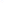

   ``preset('acs')``: 83 mm wide whatever the molecule, since it states ``width_mm`` rather than a
   scale, with heavier lines and the stored CIP descriptors switched on.

.. testcode::

    svg = caffeine.depict(style=DepictStyle.preset('poster'))

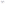

   ``preset('poster')``: a fixed 14 mm per molecule unit, so the picture's size follows the molecule's.

To change the default for a whole process -- a notebook, a script that draws a hundred structures --
install one, and read it back with ``get_depict_style()``:

.. testcode::

    from chython import get_depict_style, set_depict_style

    previous = get_depict_style()
    set_depict_style(DepictStyle.preset('print'))
    svg = mol.depict()               # uses the installed style
    current = get_depict_style()

    set_depict_style(previous)       # a process default is process-wide: put it back

The ``style=`` argument always wins over the installed default, so one figure can differ from the rest
without disturbing them.

Defaults Worth Knowing
----------------------

Three defaults draw more than a bare skeleton, because each says something a picture without it does
not:

* ``bond.aromatic`` is ``'dashed-inner'`` -- a solid perimeter with a dashed line inside each aromatic
  ring.  ``'kekule'`` draws the alternating double bonds instead, and ``'circle'`` one inner circle.  A
  **kekulized** molecule has no order-4 bond, so ``aromatic_rings`` is empty and no inner line is drawn:
  the alternating lines are already there to read.
* ``atom.map_numbers`` is ``True``, and a number is drawn only where ``map_number`` is non-zero, so an
  unmapped structure stays clean.
* ``atom.stereo_groups`` is ``True``: an enhanced-stereo collection is written beside its centre as
  ``&N`` (AND -- racemic here), ``oN`` (OR -- one of these) or ``a`` (ABS).  Hiding it would draw a single
  enantiomer where the file said otherwise.  A plain ``[C@H]`` is in no collection and gets no mark.

.. testcode::

    naphthol = smiles('c1ccc2ccccc2c1O')
    naphthol.clean2d()
    svg = naphthol.depict()

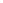

   ``bond.aromatic='dashed-inner'``, the default: one dashed line inside each aromatic ring.

.. testcode::

    svg = naphthol.depict(style=DepictStyle().tuned(**{'bond.aromatic': 'kekule'}))

   ``'kekule'``: alternating double bonds, chosen per ring by the depictor.

.. testcode::

    svg = naphthol.depict(style=DepictStyle().tuned(**{'bond.aromatic': 'circle'}))

   ``'circle'``: one inner circle per ring, inset further than the dashed line is.

.. testcode::

    racemic = smiles('C[C@H](N)[C@H](O)C |&1:1,3|')
    racemic.clean2d()
    svg = racemic.depict()                    # two `&1` marks, one at each centre

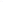

   An AND collection: both centres are in group 1, so the drawing says *racemic at these two* rather
   than naming one enantiomer.

The stereo statement and the map number occupy two fixed rows beside the label -- the stereo above the
baseline by ``label.annotation_rise``, the map number below it by ``label.annotation_drop``, both
fractions of ``label.size``.  Fixed, so one molecule's map number is not moved by another's descriptor --
and each row is slid out by its own ink's demand, so a wide ``(R)&1`` does not carry the number out with
it.  The number is the row that keeps its place, being the one on every atom of a mapped record, and the
descriptor stacks beyond it wherever the chosen side would otherwise put the two on each other.

*Which side* of the atom those rows go to is chosen per atom, one rule per degree, and every candidate is
scored against the bonds as drawn and the labels already placed -- so the first choice loses to a clear
later one:

* **one bond** -- 120 degrees off it, the lower turn first: where a drawing would have put the next
  substituent, which is where a reader looks for something belonging to this atom.  Straight back along the
  bond is the widest room there is, but it is also the atom's own line continued and, at a terminal atom,
  exactly where the hydrogens are written, so it is offered last rather than first.
* **two bonds** -- the bisector of the wider sector, then the other: outside the elbow, then inside it.
* **three or more** -- the widest sector first, then the bottom right corner, where a reader of a mapped
  structure looks.  Every sector at a fused centre is narrow and holds something, so the fixed corner is a
  candidate and not the answer: it wins only by scoring better than the sectors do.

What is never chosen is *how far* -- a row sits where the atom's own ink ends and no further, because a
number half a bond out has stopped saying which atom it belongs to.  So where a sector is crowded the number
stays put and the line gives way instead: a knock-out plate in the background colour is drawn under **every**
annotation, over the bonds and under every glyph.  ``label.annotation_plate`` selects its shape --
``'rounded'`` (the default; a disc for one digit, a stadium for three), ``'ellipse'``, or ``'none'`` to
withhold the layer -- with ``label.annotation_plate_pad`` around the measured ink.  The colour follows
``page.background``, and white where the page is transparent, since a knock-out has to be the colour of what
is behind it; ``label.annotation_plate_colour`` states it outright when that guess is wrong.  Under every
annotation and not only the ones a line crosses: a plate over the page knocks out nothing and is invisible,
while a digit in the corridor between a ring's perimeter and its inner line crosses neither and is the hard
one to read.

.. testcode::

    mapped = smiles('[CH3:1][C:2](=[O:3])[NH:4][c:5]1[cH:6][cH:7][cH:8][cH:9][cH:10]1')
    mapped.clean2d()
    svg = mapped.depict()

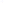

   Every atom of a mapped record carries a number, each on its own knock-out plate.  The ring's numbers
   sit in the corridor between the perimeter and the dashed inner line, which is the case the plate
   exists for.

Highlights
----------

A ``Highlight`` marks a set of atoms and bonds and encodes nothing -- there is no scale and no colorbar.
It is the overlay to reach for when the answer is *these atoms*, not *this much*:

.. testcode::

    from chython.depict import Highlight

    aspirin = smiles('CC(=O)Oc1ccccc1C(=O)O')
    aspirin.clean2d()
    svg = aspirin.depict(overlays=[Highlight(atoms=aspirin.sssr[0], label='ring')])

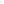

   ``style='fill'``, the default: a filled disc behind each atom, and a ribbon along each bond whose
   both ends are highlighted -- so a group is one shape rather than a row of dots.

With no colour of its own a highlight takes ``style.highlight.palette[i]`` for its position ``i`` in the
overlay list -- eight hues that stay distinguishable under deuteranopia, protanopia and tritanopia
(Wong, B. *Nature Methods* **8**, 441 (2011)), the neutral grey first.  So two groups in one picture are
told apart by position, and never by having each caller pick a colour:

.. testcode::

    from chython import smarts

    ester = next(smarts('[C;D3](=O)O[c]').get_mapping(aspirin))   # {query id: aspirin id}
    svg = aspirin.depict(overlays=[
        Highlight(atoms=aspirin.sssr[0], style='outline', label='ring'),
        Highlight(atoms=list(ester.values()), style='outline')])

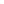

   ``style='outline'``: a stroked ring instead of a filled disc.  The two groups share one aromatic
   carbon, and there the outlines are offset outward by position, so they read as two rings rather than
   one thick line.

A label is centred above **its own group's** box and is not moved for the rest of the figure, so a group
in the middle of a structure is the case for ``label=None`` and a ``Text`` of your own beside the scene
-- which is what the last section is about.

Per-Atom and Per-Bond Channels
------------------------------

Four overlays carry a scale, and the choice between them is which visual channel the number should use.
An overlay that carries a colour scale also gets a colorbar:

===============  ======================================  ============================
overlay          encodes the value as                    keys
===============  ======================================  ============================
``AtomField``    filled contour bands and/or isolines    stable atom ids
``AtomHalo``     a disc's colour, radius, or both        stable atom ids
``BondScale``    a bond's own width and/or colour        ``(n, m)`` pairs
``ValueLabels``  a number drawn beside the atom or bond  atom ids or ``(n, m)`` pairs
``Highlight``    nothing -- it marks a set, unscaled     atom ids and/or ``(n, m)``
===============  ======================================  ============================

``AtomHalo`` is the per-atom form, and ``encode`` picks the channel: ``'color'`` (fixed radius),
``'size'`` (radius over ``field.halo_min_radius`` to ``halo_max_radius``), or ``'both'``.

.. testcode::

    from chython.depict import AtomHalo

    # Pauling electronegativity per element, as a stand-in for any per-atom scalar
    pauling = {'C': 2.55, 'N': 3.04, 'O': 3.44}
    pull = {a.n: pauling[a.atomic_symbol] for a in caffeine.atoms()}

    svg = caffeine.depict(overlays=[AtomHalo(pull, colormap='viridis', encode='both')])

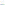

   ``encode='both'``: radius and colour both carry the value, so the figure survives being printed in
   greyscale.

``BondScale`` puts the value on the bond's own path rather than on a second path over it -- two stacked
strokes at different widths read as an outline, not as a thick bond:

.. testcode::

    from chython.depict import BondScale

    # Bond order, so the encoding is one a reader can check against the drawing
    propiolic = smiles('OC(=O)C#C')
    propiolic.clean2d()
    order = {(b.n, b.m): float(b.order) for b in propiolic.bonds()}

    svg = propiolic.depict(overlays=[BondScale(order, encode='both', colormap='cividis',
                                              width_range=(.03, .1))])

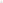

   Bond order as width and colour, over single, double and triple.  ``width_range=None`` would take
   ``field.bond_min_width`` to ``bond_max_width``, which is a range wide enough to swallow a ring's
   inner line; giving ``width_range`` with ``encode='color'`` is refused, since a parameter that cannot
   act is a typo rather than a preference.

``ValueLabels`` draws the number itself.  Keys that are all ``(n, m)`` tuples switch ``on`` to
``'bond'`` by themselves:

.. testcode::

    from chython.depict import ValueLabels

    carbonyls = {a.n: pull[a.n] for a in caffeine.atoms() if a.atomic_symbol == 'O'}
    svg = caffeine.depict(overlays=[ValueLabels(carbonyls, fmt='{:.2f}')])

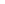

   Numbers on the two atoms that carry the answer.  Each is offset away from the mean of its
   neighbours, and there is no knock-out plate under a value label -- unlike a map number, which is on
   every atom of a mapped record and has one.  So label the few atoms the figure is about: a number on
   every atom lands on the bonds and repeats what a colour channel already showed.

Scalar Field Overlays
---------------------

``AtomField`` is the contour one, and it **interpolates**: the field is a sum of Gaussians on the named
atoms, ``f(p) = Σᵢ vᵢ·exp(−‖p − pᵢ‖²/2σ²)``, deliberately un-normalized so it decays to zero away from
the atoms.  It is not a grid renderer -- a cube file's own samples take the ``field`` module's
primitives instead, at the end of this section.

.. testcode::

    from chython.depict import AtomField

    # Hückel π charges of azulene: positive is electron-poor.  Ids run in SMILES
    # order, so 1-3 are the five-ring carbons and 4 and 10 the fusion carbons.
    azulene = smiles('c1ccc2cccccc12')
    azulene.clean2d()
    charge = dict(zip([a.n for a in azulene.atoms()],
                      [-.173, -.047, -.173, -.027, +.145, +.014, +.130, +.014, +.145, -.027]))

    svg = azulene.depict(overlays=[AtomField(charge, colormap='coolwarm')])

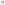

   Nine bands and a colorbar, with no further argument.  The five-ring is electron-rich and the
   seven-ring electron-poor, which is azulene's dipole drawn as a field.

Two defaults are doing that:

* ``coolwarm`` is **diverging**, and a diverging map whose data spans zero gets a **symmetrised**
  domain -- both ends become ``max(|min|, max)`` -- so the neutral midpoint lands on exactly zero.  State
  ``domain=`` to override it.  A sequential map (``viridis``, ``cividis``, ``mono``) is fitted to the data
  as it stands.  The six names are in ``NAMED_COLORMAPS``; a list of stops or a callable is also accepted.
* an integer ``levels`` **counts bands over the range the field was sampled over** (intersected with the
  colormap's domain, whose ends clamp the colour), not over that domain alone.  A level outside the
  field's own extremes has no cell with corners either side of it and draws nothing, so the count is what
  you get.  An explicit sequence states the values instead, and a
  level that traced nothing leaves a visible gap in the bar rather than a block of colour standing for an
  interval nothing was filled over.

``fill`` and ``isolines`` are independent, so line contours are ``fill=False``:

.. testcode::

    svg = azulene.depict(overlays=[
        AtomField(charge, colormap='coolwarm', fill=False,
                  levels=[-.12, -.06, 0., .06, .12])])

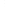

   The same field as line contours at stated levels.  The bar draws rules rather than blocks, because
   no interval of values was filled over.

A signed field has a **nodal line**, and the level at zero on a diverging map is painted that map's
neutral midpoint -- which is the colour of the page.  The node is drawn and invisible.  A second overlay
carrying only that one level on ``mono``, whose midpoint is mid-grey, is what makes it visible:

.. testcode::

    naphthalene = smiles('c1ccc2ccccc2c1')
    naphthalene.clean2d()
    homo = dict(zip([a.n for a in naphthalene.atoms()],
                    [-.2629, +.2629, +.4253, 0., -.4253, -.2629, +.2629, +.4253, 0., -.4253]))

    # Ids 4 and 9 are the fusion carbons: the HOMO coefficient there is 0, and the
    # zero contour through them is the node.  `page.legend='none'` because the two
    # overlays carry two different scales.
    node = DepictStyle().tuned(**{'page.legend': 'none'})
    svg = naphthalene.depict(style=node, overlays=[
        AtomField(homo, colormap='RdBu', clip='box'),
        AtomField(homo, colormap='mono', levels=[0.], fill=False,
                  domain=(-.4253, .4253), clip='box')])

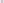

   Naphthalene's HOMO coefficients, with the nodal line drawn in grey: four lobes of alternating sign,
   nodes along the fusion axis and across it.

One colorbar cannot label two scales, and asking for it is refused rather than resolved by picking one:

.. testcode::

    try:
        naphthalene.depict(overlays=[AtomField(homo, colormap='RdBu'),
                                     AtomField(homo, colormap='mono', domain=(-.5, .5))])
    except ValueError as refused:
        print(str(refused).startswith('these overlays carry two different scales'))

.. testoutput::

    True

Two one-sided fields meant to be **compared** need one domain stated on both, or each is fitted to its
own range and the two pictures are drawn to different scales:

.. testcode::

    ids = [a.n for a in azulene.atoms()]
    f_minus = dict(zip(ids, [.295, 0., .295, .067, .026, .113, 0., .113, .026, .067]))
    f_plus = dict(zip(ids, [.004, .100, .004, .084, .221, .010, .261, .010, .221, .084]))

    shared = (0., max(max(f_minus.values()), max(f_plus.values())))
    svg = azulene.depict(overlays=[AtomField(f_minus, colormap='viridis', domain=shared)])

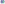

   Fukui f⁻, where an electrophile attacks.  One-sided data, so a sequential map and a domain starting
   at zero.

.. testcode::

    svg = azulene.depict(overlays=[AtomField(f_plus, colormap='viridis', domain=shared)])

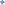

   Fukui f⁺, where a nucleophile attacks -- the same domain, so the two pictures are read against one
   scale.  Fitted separately, both would peak in the same yellow and the pair would say nothing.

Not every scalar should be contoured.  A property that barely varies across the molecule has no spatial
story for bands to tell, and contouring it draws one anyway: the interior goes flat and the whole ramp
ends up in the rim where the interpolation decays.  That is ``AtomHalo``'s case, and it draws the
numbers without inventing structure between the atoms.

Where the field **ends** is ``clip``, and ``sigma`` is how wide each atom's Gaussian is:

.. testcode::

    own = azulene.depict(overlays=[AtomField(charge)])                    # clip=None
    hull = azulene.depict(overlays=[AtomField(charge, clip='hull')])
    box = azulene.depict(overlays=[AtomField(charge, clip='box')])
    tight = azulene.depict(overlays=[AtomField(charge, sigma=.4)])

``clip=None`` is the only setting that draws the whole field, and it still closes: ``at()`` answers
``None`` past ``field.contour.cutoff``, so a band ends where the Gaussians have decayed.  ``'hull'`` and
``'box'`` are clip paths drawn through the **atoms**, padded by ``field.contour.pad``, so they slice
every band reaching past them and the contours end in mid-air -- which is what you want for a node that
would otherwise run to the edge of the sampled region.  ``sigma`` is a **scale**, not a distance: the
effective width is ``sigma × mean bond length``, so one value covers the same number of bonds whether
the plane came from ``clean2d()`` or from ångström coordinates.

Overlays compose, and the numbers belong on the few atoms that carry the answer:

.. testcode::

    extremes = sorted(charge, key=lambda n: abs(charge[n]), reverse=True)[:4]
    five_ring = next(r for r in azulene.sssr if len(r) == 5)

    svg = azulene.depict(overlays=[
        # the field is dropped to 0.55 so the numbers over it stay legible
        AtomField(charge, colormap='coolwarm', opacity=.55),
        Highlight(atoms=five_ring, style='outline', label='five-ring'),
        ValueLabels({n: charge[n] for n in extremes}, fmt='{:+.2f}')])

   Three overlays, one figure.  The numbers wear the ink colour and never the band colour under them.

``'auto'`` puts the colorbar where the space already is, reading the **content's** shape and not the
page's: a tall molecule leaves free width and gets the bar on the right, a wide one gets it underneath.
``page.legend`` states a side outright, and the bar is placed **outside** the content box, so
withholding it moves no atom:

.. testcode::

    for where in ('auto', 'right', 'bottom', 'none'):
        svg = azulene.depict(style=DepictStyle().tuned(**{'page.legend': where}),
                             overlays=[AtomField(charge)])

Composing Scenes
----------------

A ``Scene`` is a resolution-free tree of three primitives, in molecule coordinates, y-up: ``Path``
(filled and/or stroked geometry), ``Text`` (one anchored label made of runs) and ``Group`` (children
that composite together).  No chemistry -- a ``Path`` does not know it is a bond -- and no transform
stack: geometry is absolute, and ``translated()`` moves the coordinates rather than pushing a matrix, so
``bounds`` needs no composition and no backend has to express one.

Two properties of ``Scene`` are what make composition work.  ``translated()`` gives a moved copy of any
node, and **stated bounds win over the union of the children**, which is how a cell in a grid or a frame
in a series gets a fixed frame:

.. testcode::

    from chython.depict import Box, Group, Scene

    one = smiles('CCO')
    one.clean2d()
    moved = Group(one.scene().children).translated(2., 0.)
    fixed = Scene([moved], bounds=Box(0., -1., 5., 1.))     # exactly this frame, no margin added
    svg = fixed.to_svg()

Grid Depiction
~~~~~~~~~~~~~~

There is no ``grid_depict`` and no page-layout engine -- and one is not needed for a grid, because the
three pieces above are the whole of it: each molecule's ``scene()``, a ``Group`` per cell moved into
place, and one ``Scene`` with a stated frame.

.. testcode::

    from chython.depict import Box, Group, Path, Scene, Text, TextRun
    from chython.depict.scene import rounded_box

    library = ['CCO', 'c1ccccc1O', 'CC(=O)Nc1ccccc1',
               'C[C@H](N)C(=O)O', 'c1ccc2ccccc2c1', 'CN1CCCC1c1cccnc1']
    style = DepictStyle.preset('screen')

    scenes = []
    for line in library:
        member = smiles(line)
        member.clean2d()
        scenes.append(member.scene(style=style))

    # One cell size for every panel, so the molecules are drawn to one scale.  A cell
    # sized per molecule would silently scale each one differently.
    columns = 3
    cell_x = max(s.bounds.width for s in scenes) + 1.
    cell_y = max(s.bounds.height for s in scenes) + 1.2

    children = []
    for i, (panel, line) in enumerate(zip(scenes, library)):
        row, column = divmod(i, columns)
        x0, y0 = column * cell_x, -row * cell_y
        cell = Box(x0, y0, x0 + cell_x, y0 + cell_y)
        box = panel.bounds
        children.append(Path([rounded_box(cell, .12)], stroke='#dddddd', width=.02))
        children.append(Text([TextRun(line, size=.26)], x=x0 + .2, y=y0 + .2,
                             fill='#777777'))
        # Centred in its cell, and shifted up to leave the caption its row
        children.append(Group(panel.children).translated(
            x0 + (cell_x - box.width) / 2. - box.min_x,
            y0 + (cell_y - box.height) / 2. - box.min_y + .2))

    rows = -(-len(scenes) // columns)
    frame = Box(-.2, -(rows - 1) * cell_y - .2, columns * cell_x + .2, cell_y + .2)
    svg = Scene(children, bounds=frame).to_svg(style=style)

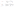

   Six molecules, one scale, one document.  The cell borders and the captions are ``Path`` and ``Text``
   nodes in the same scene as the structures -- nothing in the depictor distinguishes them.

The same three pieces place a molecule beside anything else a caller can express as paths: a reaction's
own scene, a plot, a second copy of the structure at another style.

A Calculation's Own Grid
~~~~~~~~~~~~~~~~~~~~~~~~

Samples produced on their **own grid** -- a cube file, a plane cut through a wavefunction -- are not an
``AtomField``, which would re-interpolate them from the atom positions it does not have.  ``field.Grid``
takes the samples as they are and ``isolines`` traces one level of them by marching squares, giving
polylines to place in a scene:

.. testcode::

    from chython.depict.field import Grid, contour_levels, isolines
    from chython.depict.scene import polyline

    structure = naphthalene.scene()
    box = structure.bounds.inflate(.6)

    # A calculation's own samples, row-major from the lower left -- here a density-like Σ 1/r² over the
    # plane the structure occupies, which is where a cube file's cut would have been taken
    atoms = list(naphthalene.coordinates().values())
    step = .1
    nx, ny = int(box.width / step) + 1, int(box.height / step) + 1
    z = [sum(1. / (.09 + (box.min_x + i * step - x) ** 2 + (box.min_y + j * step - y) ** 2)
             for x, y in atoms)
         for j in range(ny) for i in range(nx)]
    grid = Grid(box.min_x, box.min_y, step, nx, ny, z)

    paths = [Path([polyline(chain)], stroke='#666666', width=.02)
             for level in contour_levels(6, min(z), max(z))
             for chain in isolines(grid, level)]

    svg = Scene([*paths, *structure.children]).to_svg()

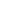

   Six traced levels of samples made on their own grid, under the structure -- ``isolines`` returns
   polylines and the scene decides what they are drawn as.  ``Grid`` accepts ``None`` for a sample that
   is undefined, and a cell touching one traces nothing rather than interpolating across the hole.

``ScalarField`` is the interpolating field itself, should you want the values ``AtomField`` contours
without the drawing: ``at()``, an analytic ``gradient()``, and ``bounds()``.

3D Depiction
------------

``mol.depict3d(index)`` renders a **stored conformer** as an X3DOM document -- a sphere per atom, sized
from ``Atom.atomic_radius`` and coloured from the CPK palette, and cylinders for bonds: one, two offset,
three, or dashes for an order nothing pins. ``mol.view3d(index, width, height)`` is that document in a
Jupyter widget.

.. testcode::

    from chython import smiles

    mol = smiles('C#N')
    mol.set_xyz(1, .0, .0, .0)
    mol.set_xyz(2, 1.16, .0, .0)

    xml = mol.depict3d()
    print(xml.count('<sphere'), xml.count('<cylinder'))

    widget = mol.view3d(width='100%', height='300px')
    print(widget.xml == xml)                        # the widget IS the document, at a stated size

.. testoutput::

    2 3
    True

**A conformer is read, never guessed.** A molecule with no model raises ``ValueError`` rather than being
drawn against an invented geometry -- the temporary-plane fallback ``depict()`` uses has no counterpart
here, because a 2D layout follows from the graph and a geometry does not. ``mol.has_3d`` is the test and
:func:`chython.interop.conformers.generate_conformers` makes one; an ``index`` past the last model raises
``IndexError``, as it does on ``mol.conformer(i)``.

The model is centred on its own centroid before rendering, so a conformer taken from a crystal file is
drawn at the origin. The rendering parameters are ``chython/depict/x3dom.py``'s own frozen
``_X3DOM_DEFAULTS`` and **not** ``DepictStyle``, which is 2D throughout. An R carries no radius, so the
marker is drawn as its own label in the same colour the 2D side gives it.

The widget loads the X3DOM runtime from ``x3dom.org``: a notebook opened offline shows an empty box,
while the document ``depict3d()`` returns is complete and is what to save. This page loads that same
runtime, so the block below shows the scene it drew rather than a picture of it -- drag to rotate, scroll
to zoom. Cyclohexane in its ideal chair, where a flat figure is the wrong medium:

.. testcode::

    from math import cos, pi, sin

    chair = smiles('C1CCCCC1')
    for i, n in enumerate(chair.atom_numbers):
        angle = i * pi / 3                          # 1.46 A radius and a +-0.25 A pucker is C-C = 1.54
        chair.set_xyz(n, 1.46 * cos(angle), 1.46 * sin(angle), .25 if i % 2 else -.25)

    xml = chair.depict3d()
    print(xml.count('<sphere'), xml.count('<cylinder'))

.. testoutput::

    6 6

.. raw:: html
    :file: scenes/chair.html

``docs/scenes/`` holds no markup a person wrote: ``python docs/figures.py`` regenerates each scene from the
block above it exactly as it regenerates ``docs/images/``, and ``--check`` compares byte for byte.

Regenerating the Figures
------------------------

Every picture on this page is the ``svg`` variable of the sample above it, and every 3D scene the ``xml``
variable, written out by ``python docs/figures.py``.  ``python docs/figures.py --check`` fails, naming the
files, if a sample and its output have come apart -- which is how the pictures stay true to the code
beside them.

======  ========  =================  =================================
Asset   Variable  Committed as       Referenced by
======  ========  =================  =================================
figure  ``svg``   ``images/*.svg``   ``.. figure::`` / ``.. image::``
scene   ``xml``   ``scenes/*.html``  ``.. raw:: html`` with ``:file:``
======  ========  =================  =================================
