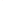
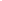

Molecules
=========

Properties, atom/bond access, building, and stereochemistry.

Every sample on this page is executed by the test suite, and the page shares one namespace down its
length: a molecule parsed in the first sample is the subject of the fifth. Each picture is the ``svg``
the sample above it left, drawn by ``depict()`` and stored by nobody -- :doc:`depiction` is the page
about that call and about the overlays a few of the figures here use.

Molecular Formula and Mass
--------------------------

.. testcode::

    from chython import smiles

    mol = smiles('CC(=O)Oc1ccccc1C(=O)O')  # aspirin

    mol.brutto            # {'C': 9, 'H': 8, 'O': 4}
    mol.brutto_formula    # 'C9H8O4'
    mol.element_counts    # {6: 9, 8: 4} -- heavy atoms, keyed by atomic number
    float(mol)            # 180.157... average atomic masses
    int(mol)              # 0 -- the total formal charge

    svg = mol.depict()    # a layout is computed for the drawing and not stored

   Aspirin, the molecule the next three sections ask their questions about. Carbons are unlabelled and
   the aromatic ring wears a dashed inner line rather than alternating double bonds, both being style
   defaults.

``float(mol)`` and ``int(mol)`` are the mass and the charge. ``molecular_mass`` and
``molecular_charge`` are the second spelling of each, exactly equal and warning-free.

``brutto_formula_html`` is the same string with each count above one in a ````, for a template
that renders a formula rather than printing it:

.. testcode::

    print(mol.brutto_formula_html)

.. testoutput::

    C9H8O4

Drug-Likeness Descriptors
-------------------------

.. testcode::

    mol.hydrogen_bond_donors_count     # N/O/S with H
    mol.hydrogen_bond_acceptors_count  # O/N/S with lone pairs
    mol.rotatable_bonds_count          # non-ring single bonds (excludes amide-like)
    mol.carbon_count
    mol.carbon_sp3_count
    mol.carbon_sp3_fraction            # sp3 carbons / total carbons

    mol.tpsa                           # topological polar surface area
    mol.crippen_logp                   # Wildman-Crippen logP
    mol.crippen_mr                     # Wildman-Crippen molar refractivity
    mol.qed                            # quantitative estimate of drug-likeness, QED_w,mo

``qed`` is the mean-weight variant, the paper's recommended default;
``chython.chemistry.qed(mol, weights='max')`` and ``weights='unweighted'`` reach the other two published
weight sets. ``chython.chemistry.qed_properties(mol)`` returns the eight raw inputs before desirability
and ``chython.chemistry.alert_count(mol)`` the eighth of them on its own. That eighth input is
``chython/chemistry/tables/qed_alerts.tsv``'s -- 64 alerts, fewer than the 116 the published alert set
names, each one proved to fire by a probe compound in the table. A chython score and another
implementation's are therefore two numbers with the same name.

MACCS Structural Keys
---------------------

Methods rather than properties, because they return an array and a set:

.. testcode::

    keys = mol.maccs_keys()            # ndarray(167) uint8
    print(keys[0], keys[164], keys[44])

.. testoutput::

    0 1 0

**One-based**: ``keys[n]`` is published key *n* for *n* in 1..166, and index 0 is permanently zero so
that no caller writes ``n - 1``. Key 44 is permanently zero as well -- its published description is the
placeholder ``OTHER``, so there is nothing to transcribe and a guessed pattern would be invented
chemistry.

.. testcode::

    mol.maccs_bit_set()                # frozenset of the key numbers set, 1..166

The numbering is MDL's; the patterns are chython's reading of the published key descriptions, in
``chython/chemistry/tables/maccs.tsv``, and each is pinned by one molecule that must set it and one
near-miss that must not in ``tables/maccs_corpus.tsv``. Widely used implementations knowingly differ
from the published list, and where they do this table follows the publication -- so a bit that differs
from another toolkit's is a documented difference and not a defect.

Ring Properties
---------------

.. testcode::

    naph = smiles('c1ccc2ccccc2c1')  # naphthalene

    naph.rings            # [(...), (...)] -- a minimum cycle basis, atom ids per ring
    naph.sssr             # the same list: a smallest set of smallest rings IS a minimum cycle basis
    naph.rings_count      # 2 -- the circuit rank
    naph.aromatic_rings   # the subset whose every bond has order 4

.. testcode::

    from chython.depict import Highlight

    svg = naph.depict(overlays=[Highlight(atoms=ring, label=f'ring {i}')
                                for i, ring in enumerate(naph.rings, 1)])

   The two rings ``naph.rings`` returns, a colour each. The fused pair is in both and wears both; the
   ten-membered perimeter is the sum of the two and so is in no basis.

``rings`` is a **minimum cycle basis** and not the relevant-cycle set, which is exponential. Order-8
(dative) bonds are excluded, so ferrocene is two five-rings and its iron is in none of them. A
kekulized molecule has no order-4 bonds and so gets an empty ``aromatic_rings`` -- the honest answer
rather than a perception fallback.

.. testcode::

    ferrocene = smiles('[CH]1=[CH][CH]=[CH][CH]1->[Fe]<-[CH]1=[CH][CH]=[CH][CH]1')

    print(ferrocene.rings_count, ferrocene.in_ring_of(6))   # 6 is the iron
    svg = ferrocene.depict()

.. testoutput::

    2 False

   Ferrocene: two five-rings, and the iron on neither of them. A dative bond is drawn dashed, which is
   the same fact the ring code reads.

Per-atom ring questions
~~~~~~~~~~~~~~~~~~~~~~~

There is no dict of rings per atom. The per-atom descriptors carry the *relevant*-cycle semantics,
which is strictly more than the basis can say, and they are derived without ever materialising the
cycles. Ask the atom.

.. testcode::

    n = naph.atom_numbers[0]

    naph.in_ring_of(n)      # True -- is this atom in any ring at all
    naph.ring_count_of(n)   # how many relevant rings pass through it
    naph.ring_sizes_of(n)   # frozenset({6}) -- the sizes, not the rings
    naph.macrocycle_of(n)   # is it on a ring larger than 24?  False here

    # the basis rings through one atom: filter the basis yourself
    [ring for ring in naph.rings if n in ring]

    # and the same for every atom, if a dict really is what you want
    {a: [r for r in naph.rings if a in r] for a in naph}

    # "are these two atoms in one ring" needs no ring list at all
    naph.shares_ring(naph.atom_numbers[0], naph.atom_numbers[1])

    # bonds answer too
    naph.bond_in_ring(naph.atom_numbers[0], naph.atom_numbers[1])

``ring_sizes_of`` returns a ``frozenset`` of exact sizes from 3 to 24. Above 24 the size is not
recoverable from the atom -- ``macrocycle_of`` reports the fact and ``rings`` carries the size.

.. testcode::

    azulene = smiles('c1ccc2cccccc12')
    fused = [n for n in azulene if azulene.ring_count_of(n) == 2]

    print(sorted(azulene.ring_sizes_of(fused[0])))
    svg = azulene.depict(overlays=[Highlight(atoms=fused)])

.. testoutput::

    [5, 7]

   Azulene's two fusion carbons, the only atoms where ``ring_count_of`` reads 2. They are also the only
   ones whose ``ring_sizes_of`` holds two sizes, one per ring they are on.

Graph Descriptors
-----------------

.. testcode::

    mol = smiles('CC(=O)Oc1ccccc1C(=O)O')  # aspirin

    # composition
    mol.heteroatoms_count              # atoms that are neither C nor H
    mol.valence_electrons_count        # sum of Zv - charge + implicit hydrogens

    # ring systems, all of them counts over the minimum cycle basis
    mol.aromatic_rings_count
    mol.aliphatic_rings_count          # the complement: the two sum to rings_count
    mol.saturated_rings_count          # every bond in the ring is single
    mol.heterocycles_count
    mol.aromatic_heterocycles_count
    mol.spiro_atoms_count
    mol.bridgehead_atoms_count
    mol.fused_ring_systems_count       # connected components of the ring bonds

    # topological indices
    mol.randic_index                   # Randic 1975; the same number as chi(1)
    mol.zagreb_index()                 # M1; zagreb_index(2) is M2.  Gutman 1972
    mol.bertz_ct                       # Bertz 1981, with chython's stated connection partition
    mol.hall_kier_alpha                # Hall and Kier's covalent radius correction
    mol.chi(2)                         # Kier-Hall connectivity index, orders 0-4
    mol.chi(2, valence=True)           # the delta-v variant: Zv - h in place of the degree
    mol.kappa(2)                       # Kier shape index, orders 1-3
    mol.kappa(2, alpha=True)           # with the Hall-Kier alpha correction

The descriptors built on the topological distance matrix are separate, because they need numpy — an
optional dependency, ``pip install chython[ml]``. ``distance_matrix`` is the only shortest-path code in
the core, so everything that reads a vertex distance reads its array; without numpy each of these
raises ``ImportError`` naming the extra, and everything above is unaffected.

.. testcode::
    :skipif: __import__('importlib').util.find_spec('numpy') is None

    # distances -- one BFS per atom, shared with distance_matrix()
    mol.eccentricities()               # (n,) int32, indexed like distance_matrix rows
    mol.graph_radius                   # the smallest eccentricity
    mol.graph_diameter                 # the largest
    mol.wiener_index                   # Wiener 1947
    mol.balaban_j                      # Balaban 1982.  RAISES on a disconnected molecule

    # per-atom, (n,) float64.  Kier and Hall, Pharm. Res. 1990, 7, 801
    mol.estate_intrinsic_states()      # the intrinsic state I, from period, valence delta and degree
    mol.estate_indices()               # I perturbed by every other atom, weighted by 1/(dist + 1)**2

The two E-state arrays are indexed like every other per-atom array: row ``i`` belongs to
``mol.atom_numbers[i]``. Their sums are equal -- the perturbation is antisymmetric in the pair, so it
cancels over a whole molecule, across components included -- and an atom of degree 0 reports ``nan`` in
both, the intrinsic state dividing by the degree:

.. testcode::
    :skipif: __import__('importlib').util.find_spec('numpy') is None

    print(round(mol.estate_indices().sum(), 6), round(mol.estate_intrinsic_states().sum(), 6))
    print(smiles('[Na+]').estate_indices().tolist())

.. testoutput::

    40.166667 40.166667
    [nan]

Every one of these is computed on demand and none is cached: an edit changes the answer.  The graph they
describe is the graph as stored -- a dative bond is an edge and an explicit hydrogen is a vertex -- so the
classical indices, which are defined on the hydrogen-suppressed graph, want a molecule whose hydrogens are
implicit.

A disconnected molecule gets a defined answer from all of them but ``balaban_j``, which raises
``ValueError`` and names ``split()``: a vertex distance sum needs a path to every atom.

Other Properties
----------------

.. testcode::

    mol.atom_count                 # heavy atoms only
    mol.bond_count
    mol.aromatic_bond_count
    mol.is_kekule                  # exactly aromatic_bond_count == 0
    mol.connected_components_count
    mol.component_labels           # {stable id: 0-based component}, the per-atom form of that count
    mol.atoms_of_element(8)        # the ids of every oxygen, in index order
    mol.is_radical                 # True if any atom is a radical

``atoms_count`` and ``bonds_count`` are the second spelling of ``atom_count`` and ``bond_count``,
exactly equal and warning-free.

Iterating Atoms and Bonds
--------------------------

.. testcode::

    mol = smiles('CCO')

    # Iterate atom numbers -- an atom number IS its stable id
    for n in mol:
        print(n)

    # the same list, without the loop
    mol.atom_numbers

    # Iterate Atom views.  `atoms()` yields ONE object per atom, not a (number, atom) pair --
    # the number is a field of the view.
    for atom in mol.atoms():
        print(atom.n, atom.atomic_symbol, atom.element)

    # Iterate Bond views, each bond once, with bond.n the lower of the two ids
    for bond in mol.bonds():
        print(bond.n, bond.m, bond.order)  # order: 1, 2, 3, 4 (aromatic), 8 (dative)

    # Connected components
    mol.connected_components   # [(1, 2, 3)] -- a tuple of atom ids per component

.. testoutput::
    :hide:

    1
    2
    3
    1 C 6
    2 C 6
    3 O 8
    1 2 1
    2 3 1

``atom.element`` is the atomic **number**; ``atom.atomic_symbol`` is the string. There is no
``atomic_number`` field -- one field, one name, and the number is the one the arena stores.

.. testcode::

    from chython.depict import ValueLabels

    svg = mol.depict(overlays=[ValueLabels({n: n for n in mol}, fmt='{:.0f}')])

   The three ids the loops above walked. There is no style switch that draws them: the depictor's own
   per-atom number is ``map_number``, a separate field, and these are values like any other.

Single Atom / Bond Access
--------------------------

.. testcode::

    atom = mol.atom(1)       # the Atom view for id 1; KeyError when there is no such atom
    bond = mol.bond(1, 2)    # the Bond view; KeyError when the two are not bonded

    1 in mol                 # True/False -- is there an atom with this id
    mol.order_of(1, 2)       # the bond order, or None when there is no bond

    mol.index_of(1)          # the atom's position in the arena, for matrix rows
    mol.number_of(0)         # and back

``1 in mol`` and ``order_of(n, m) is not None`` are the two spellings; there is no ``has_atom`` or
``has_bond``. An absent atom raises ``KeyError`` from the id lookup.

Atom Properties
---------------

.. testcode::

    atom = mol.atom(1)

    atom.atomic_symbol       # 'C', 'N', 'O', ...
    atom.element             # 6, 7, 8, ... -- the atomic number
    atom.atomic_radius       # the calculated radius in angstroms; 0.0 for the R marker
    atom.isotope             # the mass number, 0 when the record states none
    atom.charge              # formal charge (int)
    atom.radical             # bool; `is_radical` is the same flag
    atom.implicit_h          # implicit H count, or None when nothing could derive one
    atom.explicit_h          # count of explicit H neighbours
    atom.total_h             # implicit + explicit, or None when the implicit half is unknown
    atom.degree              # bonded heavy atoms
    atom.neighbors           # the same count under an alias; the walk is mol.neighbors_of(n)
    atom.heteroatoms         # bonded atoms that are neither C nor H
    atom.hybridization       # 1=sp3, 2=sp2, 3=sp, 4=aromatic, 5=cumulated, 6=other
    atom.in_ring             # bool
    atom.ring_count          # relevant rings through this atom
    atom.ring_sizes          # frozenset of ring sizes, 3..24
    atom.macrocycle          # bool: on a ring larger than 24
    atom.map_number          # atom-atom mapping, 0 when unmapped -- SEPARATE from atom.n
    atom.n                   # the atom's number, a stable id
    atom.parity              # 0 unset, 1 even, 2 odd
    atom.stereo              # bool: parity is configured
    atom.stereo_group        # (kind, group) for an OR/AND enhanced-stereo group
    atom.cip                 # a STATED CIP descriptor ('R', 'S', ...), else None
    atom.x, atom.y           # 2D coordinates, None when there is no layout yet
    atom.xy                  # the (x, y) pair, None when there is no layout yet

There is no ``atomic_mass`` on the view: the average mass is a property of the *molecule*
(``float(mol)``), and an isotope is ``atom.isotope``.

``atomic_radius`` is the **calculated** radius -- an SCF orbital measure, neither covalent nor van der
Waals -- and it is element data, the same for every atom of an element. It is on the view because its
readers hold an atom already: it sizes a sphere in a 3D depiction and thresholds distance-based bond
perception. The header of ``chython/core/elements.tsv`` states the column, including the 32 rows the
published set does not reach, which carry the group analogue one period up.

``degree``, ``neighbors`` and ``heteroatoms`` here are **structural** counts, so a dative bond counts
like any other. The SMARTS primitives ``D``, ``x`` and ``z`` count *substituents* and ignore a dative
bond, which is why ``[N;D3]`` matches the nitrogen of ``[Fe]~N(C)(C)C`` while ``atom.degree`` reads 4.
Both are correct; they answer different questions.

Every field has a scalar accessor on the molecule, which is the form to reach for in a loop -- no view
object is built:

.. testcode::

    mol.element_of(1)
    mol.radius_of(1)
    mol.charge_of(1)
    mol.isotope_of(1)
    mol.radical_of(1)
    mol.implicit_h_of(1)
    mol.total_h_of(1)
    mol.explicit_h_of(1)
    mol.degree_of(1)
    mol.heteroatoms_of(1)
    mol.hybridization_of(1)
    mol.map_number_of(1)
    mol.xy_of(1)             # None until there is a layout
    mol.xyz_of(1)            # model 0, None unless the molecule carries a conformer -- see Conformers

Nine of the view's fields are writable -- ``charge``, ``isotope``, ``radical`` (or ``is_radical``),
``implicit_h``, ``map_number``, ``stereo``, ``x``, ``y`` and ``xy`` -- and ``Bond.order`` is too. Each
assignment goes through the molecule's own setter, so an edit journalled through a view is the same
edit as one journalled through the container. A view is invalidated by a mutation made anywhere else
and says so, rather than reading a stale atom:

.. testcode::

    atom = mol.atom(1)
    atom.charge = 1
    print(mol.charge_of(1))

    stale = mol.atom(1)
    mol.set_charge(1, 0)
    try:
        stale.charge
    except RuntimeError as e:
        print(e)

.. testoutput::

    1
    stale Atom view: the molecule was mutated

Each writable field also has a scalar setter on the molecule, which is the form a loop wants, and two
fields have only that spelling -- an atom's element and a bond's order carry consequences a plain
assignment would hide:

.. testcode::

    ethanol = smiles('CCO')
    ethanol.set_element(1, 'N')      # what the atom IS, keeping its id, its bonds and its charge
    ethanol.calc_implicit(1)         # the count the new element implies
    ethanol.set_isotope(1, 15)       # 0 clears it
    ethanol.set_radical(1, False)
    ethanol.set_hydrogens(1, 2)      # or H_UNKNOWN -- see :doc:`standardize`
    ethanol.set_map_number(1, 3)     # annotation only: never part of identity
    ethanol.set_order(1, 2, 2)
    print(ethanol)

.. testoutput::

    [CH2](=[15NH2])O

``set_element`` is why a mutation exists for the field at all: rebuilding the atom to change it would
allocate a new stable id and break every reference held to the old one. It keeps the id, and the
hydrogen count it leaves in place is the previous element's -- ``calc_implicit`` is the call that fixes
that, and :doc:`standardize` is the page about it.

Conformers
----------

``xyz_of`` and ``has_3d`` answer for model 0. A molecule holds up to 65535 models, reached through
``mol.conformers`` -- a tuple of ``Conformer`` views -- or ``mol.conformer(i)``, which raises
``IndexError`` rather than ``KeyError`` because an index is a list position and not a stable id. A
``Conformer`` answers ``index``, ``ext_index`` (the number the file gave the model, or None),
``xyz_of(n)`` and ``coordinates``. Models are written through ``edit()``:

.. testcode::

    from chython import smiles

    water = smiles('O')
    numbers = water.atom_numbers                    # a clean read; a session refuses one
    with water.edit():
        for n in numbers:
            water.set_xyz(n, 0., 0., 0.)            # model 0, created by setting it
        second = water.add_conformer(ext_index=2)
        for n in numbers:
            water.set_xyz(n, 1., 1., 1., model=second)

    print(len(water.conformers), water.conformers[1].ext_index)
    print(water.conformer(1).xyz_of(numbers[0]))
    print(water.xyz_of(numbers[0]))

.. testoutput::

    2 2
    (1.0, 1.0, 1.0)
    (0.0, 0.0, 0.0)

``add_conformer`` returns the new model's index and ``drop_conformer(i)`` removes one, the survivors
compacting down. One session either adds or drops, never both: a drop shifts the models above it while
an add counts from the unshifted count, so an index returned before the seal would mean something else
after it. A conformer is out of the molecule's identity -- two molecules that differ only in their
geometry are equal and hash alike.

``mol.depict3d(index)`` draws a stored model and ``mol.view3d(index)`` shows it in a notebook; both are
documented in :doc:`depiction`. Neither invents a geometry -- a molecule carrying no model is refused,
where the 2D side falls back to a temporary plane.

The R Marker
------------

An R is element 0: a marker for a fragment's attachment point. It is not a query primitive and not an
element -- ``[R]`` inside a SMARTS pattern goes on meaning ring count -- and it obeys three rules:

* **It matches nothing.** No query reaches an R, ``[A]`` and ``[*]`` included.
* **It reads as carbon for a NEIGHBOUR's derived features**: the neighbour's neighbour count, implicit
  hydrogen count and heteroatom count all see a carbon, so a fragment's site carries the hydrogen count
  it will carry once the marker is replaced.
* **It is never carbon for identity.** The canonical form, ``==``, ``hash``, the brutto formula and the
  fingerprints all separate an R from a carbon.

The spellings, per format:

* SMILES: ``[R]`` for an unindexed marker, ``[R1]`` through ``[R99]`` for an indexed one.
* CTfile: the V2000 symbol column and the V3000 atom-type token read ``R``, ``R#``, ``R<n>`` and ``*``,
  the index coming from an ``M  RGP`` line (V2000) or an ``RGROUPS=`` keyword (V3000). The writers emit
  a bare ``R`` for an unindexed marker, and ``R#`` plus ``M  RGP`` / ``RGROUPS=(1 <n>)`` for an indexed
  one, which is the form other readers expect.

The accessors are two read-only fields on the atom view and one setter on the edit session:

.. testcode::

    from chython import R_INDEX_MAX

    marked = smiles('[R1]c1ccccc1')
    print(marked.atom(1).is_r, marked.atom(1).r_index, marked.atom(1).atomic_symbol)

    with marked.edit() as e:
        e.set_r_index(1, 7)
    print(marked.atom(1).atomic_symbol, R_INDEX_MAX)

.. testoutput::

    True 1 R1
    R7 99

.. testcode::

    svg = marked.depict()

   The marker draws as its own symbol -- ``R7`` after the edit above, and never as the carbon it reads
   as for its neighbour's hydrogen count.

A molecule holding an R is refused as a query, the marker matching nothing so the query could never
match, and ``inchi``, ``inchikey`` and ``pack`` refuse it too, neither format having a field for it. It
is a legitimate substructure TARGET: asking whether an ordinary molecule is a substructure of an
R-bearing one answers False rather than raising.

The sticker enumerators in :doc:`reactions` are the marker's first consumer -- they cut a molecule at a
coupling handle and cap the cut with an R.

Atom Neighbors / Environment
-----------------------------

There is no ``environment(n)`` yielding ``(neighbour, bond, atom)`` triples. The question splits into
two, and each half is answered directly rather than by a tuple whose shape depends on its arguments:

.. testcode::

    n = mol.atom_numbers[1]

    # who are the neighbours, and what is each bond?
    for m in mol.neighbors_of(n):
        print(m, mol.order_of(n, m), mol.element_of(m))

    # the Atom/Bond views, when you want them
    for m in mol.neighbors_of(n):
        atom, bond = mol.atom(m), mol.bond(n, m)

    # just the numbers -- `neighbors_of` already IS that call
    mol.neighbors_of(n)

.. testoutput::
    :hide:

    1 1 6
    3 1 8

For an environment *as a molecule*, ``augmented_substructure`` cuts one out, counting bonds from a
seed:

.. testcode::

    tol = smiles('Cc1ccccc1')
    seed = [tol.atom_numbers[1]]

    tol.augmented_substructure(seed, deep=0)   # the seed alone
    tol.augmented_substructure(seed, deep=1)   # plus its direct neighbours
    tol.augmented_substructures(seed, deep=3)  # every shell, as a list, seed first

The radius saturates rather than raising, and ``augmented_substructures`` stops as soon as a shell
adds no atom, so its list may be shorter than ``deep + 1``.

.. testcode::

    from chython.depict import AtomHalo

    depth = {}
    for i, shell in enumerate(tol.augmented_substructures(seed, deep=2)):
        for n in shell.atom_numbers:
            depth.setdefault(n, i)         # the shell an atom first appears in

    svg = tol.depict(overlays=[AtomHalo(depth, colormap='viridis', encode='color')])

   The shells around one ring carbon: 0 is the seed, 1 its neighbours, 2 one bond further. The atom
   with no halo is the para carbon, which ``deep=2`` does not reach.

Adjacency Matrix
-----------------

Both matrices are numpy arrays, so both need ``pip install chython[ml]``; without it they raise
``ImportError`` naming the extra.

.. testcode::
    :skipif: __import__('importlib').util.find_spec('numpy') is None

    adj = mol.adjacency_matrix()                # 0/1
    adj = mol.adjacency_matrix(set_bonds=True)  # the stored bond order as the value

    dist = mol.distance_matrix()                # topological distances

Rows and columns are **arena positions, not atom numbers**: row ``i`` is ``mol.atom_numbers[i]``, and
``mol.index_of(n)`` is the inverse. A matrix keyed by atom number is not expressible once numbers are
sparse, which they are after any deletion.

Building Molecules
------------------

.. testcode::

    from chython import MoleculeContainer

    mol = MoleculeContainer()

    # Add atoms.  The return value is the new atom's stable id, allocated by the container --
    # there is no `n=` argument, because an id is never chosen and never reused.
    n1 = mol.add_atom('C')          # from symbol
    n2 = mol.add_atom('C')
    n3 = mol.add_atom(8)            # from atomic number (oxygen)

    # Add bonds (1=single, 2=double, 3=triple, 4=aromatic, 8=dative)
    mol.add_bond(n1, n2, 1)
    mol.add_bond(n2, n3, 2)

    # A builder states nothing about hydrogens, so the counts start unknown.  Derive them.
    mol.derive_hydrogens()
    print(mol)

.. testoutput::

    C(C)=O

``add_atom`` also takes ``charge``, ``isotope``, ``radical``, ``map_number`` and ``implicit_h`` as
keywords. Omitting ``implicit_h`` says *nothing* about hydrogens and stores the unknown sentinel; pass
``implicit_h=0`` to state that the atom carries none.

To choose the numbers, build first and relabel:

.. testcode::

    salt = MoleculeContainer()
    a, b = salt.add_atom('C'), salt.add_atom('O')
    salt.add_bond(a, b, 1)
    salt.remap({a: 10, b: 20})
    print(salt.atom_numbers)

.. testoutput::

    [10, 20]

``remap`` is in place and moves only the labels: atom order, bonds and every derived descriptor are
untouched. For a relabelled copy, ``mol.copy().remap(...)``.

Deleting, and batching several edits into one recalculation:

.. testcode::

    # Batch modifications -- derived data is recomputed once, on leaving the session
    with mol.edit() as e:
        n4 = e.add_atom('N', implicit_h=2)
        e.add_bond(n2, n4, 1)

    # Delete atom/bond
    mol.delete_bond(n2, n4)
    mol.delete_atom(n4)

    print(mol)

.. testoutput::

    C(C)=O

An edit session is the only way to defer recalculation: it happens on ``__exit__``, and an exception
inside the block discards the journal rather than leaving a half-applied molecule behind.
``with mol:`` is the same session under a shorter name, and the two nest.

An id is allocated once and **never reused**, which is what makes it safe to hold one across an edit:

.. testcode::

    chain = MoleculeContainer()
    with chain.edit() as e:
        ids = [e.add_atom('C'), e.add_atom('C'), e.add_atom('C'), e.add_atom('O')]
        for n, m in zip(ids, ids[1:]):
            e.add_bond(n, m, 1)

    chain.delete_atom(ids[0])              # 1 is gone
    with chain.edit() as e:
        e.add_bond(ids[1], e.add_atom('N'), 1)
    chain.derive_hydrogens()

    print(chain.atom_numbers)
    svg = chain.depict(overlays=[ValueLabels({n: n for n in chain}, fmt='{:.0f}')])

.. testoutput::

    [2, 3, 4, 5]

   The numbers are sparse and mean it: deleting 1 left 2, 3 and 4 where they were, and the nitrogen
   added afterwards is 5. A matrix row, which cannot be sparse, is ``index_of(n)``.

Merging and Splitting
---------------------

.. testcode::

    from chython import smiles

    # Split disconnected components -- always a list, even for one component
    anion, cation = smiles('[Cl-].[Na+]').split()
    print(anion, cation)

    # Merge molecules (union)
    both = anion | cation
    both = anion.union(cation, remap=True)  # renumber `cation` above `anion`'s highest id

    # Extract substructure by atom numbers.  Numbers are the source's, and stereo does NOT survive.
    toluene = smiles('Cc1ccccc1')
    ring = toluene.substructure(toluene.atom_numbers[1:])

    # Copy
    copied = toluene.copy()

.. testoutput::

    [Cl-] [Na+]

``union`` with ``remap=False`` **refuses** when the two sides share an atom number, rather than
quietly merging two different atoms into one.

``split()`` reports the components the molecule already **has**, and a salt is often not drawn as one:
``CC(=O)O[Na]`` is a single component here, because the record drew a covalent Na-O bond and calling
that bond wrong is a chemistry judgement rather than a graph one. Run ``split_salts()`` first when it
matters:

.. testcode::

    acetate = smiles('CC(=O)O[Na]')
    print(len(acetate.split()))
    acetate.split_salts()
    print(len(acetate.split()))

.. testoutput::

    1
    2

``split_salts()`` is one of the two passes reading ``chython/chemistry/tables/salts.tsv``, beside
``decompose_salts()``, which reports the record as compound plus counterions and changes nothing.
:doc:`standardize` documents both.

Stereochemistry
---------------

Inspecting
~~~~~~~~~~

A **stereo unit** is one record describing one place a configuration could live, whatever its kind.
One accessor covers every kind; there is no dict per kind of centre.

.. testcode::

    mol = smiles('C/C=C/C')  # trans-2-butene

    mol.stereo_units()       # every place that COULD carry a configuration
    mol.stereogenic_units()  # the subset that really can hold two configurations

    mol.chiral_atoms()       # {id: unit} for the ATOM kinds: tetrahedral centres, allene axes
    mol.chiral_bonds()       # {(n, m): unit} for the BOND kinds: cis/trans, atropisomers

    unit = mol.chiral_bonds()[(2, 3)]
    print(unit['kind'], unit['parity'], unit['refs'], unit['stereogenic'])

.. testoutput::

    1 1 (1, None, 4, None) True

A unit is a dict ``{kind, parity, n_refs, anchor, refs, unnamed_mask, stereogenic}``. ``anchor`` is the
atom the parity is stored against; ``refs`` is a 4-tuple naming the anchor's directions, and it is the
**order the parity is stated in**. ``parity`` is 0 unset, 1 even, 2 odd -- so "which centres are
configured" is a filter on this list and not a second accessor:

.. testcode::

    [u for u in mol.stereogenic_units() if u['parity']]        # configured
    [u for u in mol.stereogenic_units() if not u['parity']]    # stereogenic but unsigned

``chiral_atoms()`` answers RDKit's ``FindPotentialStereo`` question -- every site whose configuration
this record's identity depends on, labelled or not. The labelled ones are **not** subtracted; for the
sites still needing a sign, filter on the parity.

One per-atom question, three whole-molecule ones, and the stated CIP descriptors:

.. testcode::

    chiral = smiles('C[C@H](O)F')

    chiral.is_chiral(2)         # does atom 2 anchor a stereogenic unit?  Labelled or not.
    chiral.is_asymmetric()      # is the automorphism group trivial?
    chiral.has_stereo_groups    # any OR/AND enhanced stereo present
    chiral.stereo_groups()      # {id: (kind, group)}
    chiral.stereo_truncated     # True when the symmetry search ran out of budget, so the
                                # stereogenic sets above are an over-approximation

    chiral.atom_cips()          # {id: descriptor} -- STATED descriptors only, never derived
    chiral.bond_cips()
    chiral.cip_log              # what an edit dropped, and why

    # the sites still needing a sign
    [n for n in chiral.chiral_atoms() if chiral.parity_of(n) == 0]

Setting
~~~~~~~

Writing a configuration is a write and a check, never one call that judges inside the setter: the unit
publishes its ``refs`` order, ``set_parity`` writes a sign in that order, and ``validate_stereo()``
asks afterwards which signs the constitution can justify.

.. testcode::

    mol = smiles('CC(O)F')
    unit, = mol.stereogenic_units()
    print(unit['anchor'], unit['refs'])

    # 1 = even, 2 = odd, 0 = unset, stated in the unit's own `refs` order
    mol.set_parity(unit['anchor'], 2)
    print(mol.parity_of(unit['anchor']), mol.stereo_of(unit['anchor']))

.. testoutput::

    2 (1, 3, 4, None)
    2 True

.. testcode::

    svg = mol.depict(overlays=[ValueLabels({n: n for n in mol}, fmt='{:.0f}')])

   The ids ``refs`` names, on the molecule the sign was just written to: ``(1, 3, 4, None)`` is methyl,
   hydroxyl, fluorine and then the implicit hydrogen, which has no id to name. The wedge is the
   depictor reading parity 2 back -- nothing stored one.

``set_stereo(n, True/False)`` is the boolean spelling of the same write -- ``True`` is parity 2,
``False`` is parity 1 -- and cannot express "unset". Prefer ``set_parity``.

To state a parity in **your own** order rather than the unit's, ``translate_stereo`` converts between
the two:

.. testcode::

    # what is the stored parity, read in the order I care about?
    mol.translate_stereo(unit['anchor'], (3, 1, 4, None))

A parity is accepted into the arena unconditionally, because the centre that justifies it need not
exist yet while a molecule is being built. The question is asked once, on a finished molecule:

.. testcode::

    dropped = mol.validate_stereo()   # the signs it could not justify -- and they are cleared
    print(dropped)

    mol.clean_stereo()                # wipe EVERY kind of stereo state, unconditionally

.. testoutput::

    []

Wedges are a drawing, so they are written as one -- narrow end first, and the code says which way the
bond leaves the plane:

.. testcode::

    wedged = smiles('C[C@H](O)F')
    wedged.clean2d()
    wedged.set_wedge(2, 3, 1)     # 0 none, 1 up, 2 down, 3 either

    wedged.wedge_of(2, 3)         # the DIRECTIONAL read: is there a wedge pointing this way
    wedged.wedge_between(2, 3)    # (narrow_id, code), or None -- direction-agnostic
    print(wedged.wedges())

.. testoutput::

    [(2, 3, 1)]

Hashing and Comparison
-----------------------

Molecules are hashable, and both ``__eq__`` and ``__hash__`` are computed from the **canonical form**
of what the molecule is storing:

.. testcode::

    mol1 = smiles('CCO')
    mol2 = smiles('OCC')

    print(mol1 == mol2, hash(mol1) == hash(mol2))

    # Use in sets and dicts
    unique = {smiles('CCO'), smiles('OCC'), smiles('c1ccccc1')}
    print(len(unique))

.. testoutput::

    True True
    2

Because they answer for what is *stored*, on their own they mean "same drawing" and not "same
compound". ``canonicalize()`` is the pass that closes the gap, and it is the pass to run before
deduplicating a corpus:

.. testcode::

    aromatic, kekule = smiles('c1ccccc1O'), smiles('C1=CC=CC=C1O')
    print(aromatic == kekule)

    aromatic.canonicalize()
    kekule.canonicalize()
    print(aromatic == kekule)

.. testoutput::

    False
    True

``canonical_bytes`` is the identity itself -- equal bytes mean the same compound -- and it is what the
hash is built from:

.. testcode::

    identity = mol1.canonical_bytes

``bytes(mol)`` is **not** that. It is ``to_bytes()``: the arena's persistent prefix, lossless and
readable back. The lossy record has its own call, ``pack()``:

.. testcode::

    raw = bytes(mol1)                        # == mol1.to_bytes(), lossless
    back = MoleculeContainer.from_bytes(raw)
    print(back == mol1)

.. testoutput::

    True

**Warning**: avoid modifying a molecule (standardize, aromatize, add or remove atoms) after placing it
in a set or a dict. Every edit changes the canonical form, so the hash changes and the lookup breaks.
