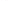

Reactions & Templates
=====================

Parsing, standardization, SMIRKS templates, reaction enumeration, functional groups, and deprotection.

Parsing Reactions
-----------------

``smiles()`` is polymorphic: an arrow makes it return a ``ReactionContainer``, its absence a
``MoleculeContainer``, so one call reads a corpus that mixes the two.

.. testcode::

    from chython import smiles

    rxn = smiles('[CH3:1][OH:2]>>[CH3:1][NH2:3]')

    # Access components
    rxn.reactants   # tuple of MoleculeContainers
    rxn.products    # tuple of MoleculeContainers
    rxn.agents      # tuple of MoleculeContainers (solvents, catalysts)

    # Iterate all molecules, in reactants -> agents -> products order
    for mol in rxn.molecules():
        print(str(mol))

.. testoutput::

    CO
    CN

.. testcode::

    # Metadata.  The title is a str and is replaced through a method, not assigned to.  A name line
    # in an RXN or RDF record is not required to be UTF-8, so a byte that is not decodes to a lone
    # surrogate and encodes back to itself -- `errors='surrogateescape'`, both directions.
    rxn.set_title('Amination')
    assert rxn.title == 'Amination'
    rxn.meta['temperature'] = '100'

Both ``reactants>products`` and ``reactants>agents>products`` are read, and any side may be empty, so
``'CC>>'``, ``'>>CC'`` and ``'>>'`` are all valid records. A ``>`` that belongs to a dative bond is
not the arrow: ``smiles('N->[Cu]>>N')`` is one reactant and one product.

Each side splits on ``.`` into one molecule per component, and the CXSMILES ``f:`` field is what puts
them back together -- without it a salt reactant becomes two reactants:

.. testcode::

    len(smiles('[Na+].[Cl-]>>CC').reactants)             # 2
    len(smiles('[Na+].[Cl-]>>CC |f:0.1|').reactants)      # 1, one molecule of two components

One ``|...|`` tail applies to the whole string, and its atom indices count every atom of every side in
written order -- reactants, then agents, then products.

Use ``read_reaction_smiles`` where a reaction is the only acceptable answer; it refuses a string with
no arrow instead of returning a molecule. Like ``read_smiles``, it takes a ``log`` list, which is the
only way to see what the reader repaired:

.. testcode::

    from chython import read_reaction_smiles

    log = []
    salt = read_reaction_smiles('[Na+].[Cl-]>>CC |f:0.9|', log=log)
    log   # ['the CXSMILES component group `f:0.9` names component 9, but the reaction has 3; ...']

Reaction Signatures
-------------------

A reaction SMILES, with each side's molecules sorted by their own string so that the same reaction
assembled in any order gives one string. This is a reaction SMILES and not a SMIRKS: a SMIRKS is a
*template*, read by :func:`chython.read_smirks`, and the two notations are not interchangeable.

.. testcode::

    str(rxn)             # 'CO>>CN' -- reaction SMILES
    rxn.smiles           # same string, as a property
    format(rxn, 'm')     # '[CH3:1][OH:2]>>[CH3:1][NH2:3]' -- with atom mapping

    # Format specifiers, all of them forwarded to each molecule's writer unchanged
    format(rxn, '!c')    # keep the container's order of molecules within each side
    format(rxn, 'a')     # asymmetric ring closures
    format(rxn, '!s')    # no stereo marks
    format(rxn, 'A')     # aromatic bonds instead of aromatic atoms
    format(rxn, 'h')     # show implicit hydrogens
    format(rxn, '!b')    # no bond tokens
    format(rxn, '!x')    # no CXSMILES tail
    format(rxn, '!z')    # no charges
    format(rxn, 'r')     # a fresh random atom order in every molecule

An unknown key raises ``ValueError`` rather than being ignored.  ``r`` and the stored-order key ``i``
both name where the atom order comes from, so a spec holding both is refused.

The tail carries radicals (``^1:``), the enhanced stereo groups (``a:``, ``&n:``, ``on:``) and ``f:``,
whose groups name the components of every molecule that has more than one -- so a salt reactant
survives a round trip as one molecule. AND/OR group ids are renumbered across the whole reaction,
because two molecules' ``&1`` are two different groups.

.. testcode::

    str(smiles('[Na+].[Cl-]>>CC |f:0.1|'))   # '[Na+].[Cl-]>>CC |f:0.1|'

The sort is over *molecules*, not components, which is why the salt above keeps its written order: it
is one molecule on that side, and the order of components inside it is the molecule writer's.

Reactions are hashable and comparable, same as molecules -- and, same as molecules, on the canonical
form and never on a string:

.. testcode::

    rxn1 = smiles('CCO.CC(=O)O>>CCOC(C)=O.O')
    rxn2 = smiles('CC(=O)O.CCO>>O.CCOC(C)=O')

    rxn1 == rxn2         # True: one reaction, assembled in two orders
    {rxn1, rxn2}         # set deduplication -- one element

Reaction Standardization
------------------------

ReactionContainer has the same standardization methods as molecules.  Each one runs the molecule pass
of the same name over every molecule on every side, **mutates in place**, and returns whether anything
changed:

.. testcode::

    rxn.standardize()           # -> bool
    rxn.canonicalize()          # -> bool; keep_kekule=True leaves the Kekule form in place
    rxn.kekule()                # -> bool
    rxn.thiele()                # -> bool
    rxn.explicify_hydrogens()   # -> int, how many hydrogen ATOMS were added
    rxn.implicify_hydrogens()   # -> int, how many were folded back into counts
    rxn.clean_isotopes()        # -> bool, did any side carry an isotope label?
    rxn.clean_stereo()          # -> dict keyed by location; see below

Nothing here returns a new reaction: a record arrives from a file, is repaired, and is written or
stored, and copying three sides on every pass over a million records would cost more than the passes.
Keep ``rxn.copy()`` if you want the original.

``rxn.canonicalize()`` does **not** touch the atom-to-atom mapping: mapping repair is not a chemistry
pass, and a caller asking for a canonical representation has not asked for their mapping to be
rewritten.

``rxn.explicify_hydrogens()`` **pairs the new hydrogens across the arrow.**  A hydrogen added to a
mapped atom on the left and one added to the atom with the same map number on the right are given the
same new number -- they are the same hydrogen, and numbering them differently would produce a mapping
claiming that a C-H bond broke and an identical one formed.  Hydrogens in a molecule that has no
mapping are left unmapped, since numbering them would invent a mapping the record never stated.

``rxn.clean_stereo()`` is the one pass here whose answer is neither a bool nor a count.  It returns the
molecule report **keyed by location** -- the same string a log record's ``subject`` carries, so a key is
also how the molecule is addressed again -- and a molecule that carried no stereo is absent rather than
present and empty:

.. testcode::

    chiral = smiles('C[C@H](F)Cl.CC>>C[C@@H](F)Br')
    print(chiral.clean_stereo())

.. testoutput::

    {'reactants[0]': {'parities': [2]}, 'products[0]': {'parities': [2]}}

No pass takes a ``log=``.  Every record goes to ``rxn.log``, always, and a copy stays on the component's
own ``.log`` -- so the two ends answer the same question and there is nothing to enable:

.. testcode::

    rxn.standardize()

    rxn.log.by_subject('products[0]')   # which MOLECULE a record is about -- rxn.products[0]
    rxn.log.by_stage('standardize')     # which pass wrote it
    rxn.log.repaired()                  # the input was wrong and the answer differs from what it said
    rxn.log.lost()                      # a fact could not be derived and is now unknown

``subject`` is the field that makes a reaction-level log readable at all: a record's ``atoms`` are
stable ids **in one container**, so without knowing which molecule a record is about, the numbers in it
name a different atom depending on where you look them up.  Nothing is encoded into ``rule`` to
compensate:

.. testcode::

    nitro = smiles('CC>>CN(=O)=O')   # a pentavalent nitro drawn without its charges
    nitro.standardize()              # True

    record = nitro.log[0]
    record.subject   # 'products[0]'  -- the molecule
    record.stage     # 'standardize'  -- the pass
    record.rule      # 'groups:12'    -- the molecule-level rule, untouched
    record.atoms     # (1, 2, 3, 4)   -- stable ids in nitro.products[0], and only there
    record.message   # why the rule fired
    record.severity  # 'info'

    # and the component holds the same record, unstamped: ids there mean what they say
    nitro.products[0].log[0].subject   # ''

``rxn.explicify_hydrogens()`` records the map number it gave each new hydrogen and whether it was
paired across the arrow or is unmatched -- which is the one thing in these passes with no molecule-level
counterpart to report it.

Reaction-specific methods -- the ones with no molecule-level counterpart, because they are statements
about the relation between the sides:

.. testcode::

    # Move the molecules that are not part of the transformation out of reactants and products.
    # With keep_reagents they become agents; without it they are dropped.
    mapped = smiles('[Na+:1].[OH-:2].[CH3:7][O:5][C:4]([CH3:3])=[O:6]>>[CH3:3][C:4]([OH:8])=[O:6]')
    mapped.remove_reagents(keep_reagents=True)            # True: read the atom-to-atom mapping

    # No mapping to read: use the rules instead, plus a solvent list you supply
    unmapped = smiles('CC(=O)O.CCN.Cc1ccccc1>>CCNC(C)=O')
    unmapped.remove_reagents(mapping=False)                             # False: nothing is on both sides
    unmapped.remove_reagents(mapping=False,
                             common=[smiles('Cc1ccccc1')])              # True: toluene is a solvent here

    # Join the free ions on each side into salts
    mapped.contract_ions()

    # Renumber every atom 1..N from a single counter spanning all three sides
    mapped.reset_mapping()

``remove_reagents(mapping=True)`` is the default and reads the reaction centre off the mapping: a
molecule none of whose atoms change is not part of the transformation.  It raises ``ValueError`` on a
record with no mapping to read, naming ``mapping=False`` -- the rule-based door, which moves a molecule
appearing on **both** sides, plus anything in ``common``.  ``common`` is a list you pass rather than a
built-in table of solvents, because a solvent table is chemistry knowledge and does not belong in the
container.  Matching is by molecule equality, so aromatise or kekulise both sides first: ``c1ccccc1``
and ``C1=CC=CC=C1`` are one molecule to a chemist and two to ``==``.

Neither door will empty a side.  A reaction whose every reactant looks like a reagent is a record these
passes cannot improve, and it comes back unchanged with ``False``.  ``contract_ions`` refuses the same
way: two different cations and one anion stay separate molecules, because nothing in the record says
which the anion belongs to.

Example workflow, with the output each line actually produces:

.. testcode::

    rxn = smiles('[Na+:1].[OH-:2].[CH3:7][O:5][C:4]([CH3:3])=[O:6]>>[CH3:3][C:4]([OH:8])=[O:6]')
    rxn.contract_ions()                      # True: Na+ and OH- become one molecule, NaOH
    rxn.remove_reagents(keep_reagents=True)   # True: NaOH has no reaction centre, so it is an agent

    [m.smiles for m in rxn.reactants]        # ['O=C(C)OC']   -- methyl acetate, the only reactant left
    [m.smiles for m in rxn.agents]           # ['[OH-].[Na+]']
    [m.smiles for m in rxn.products]         # ['C(C)(=O)O']

The Modelling View
------------------

``rxn.modeling_view()`` is a dict assembly over the array views documented in :doc:`ml`, and it is
what stands in for a CGR; it requires ``chython[ml]``.  There is no ``CGRContainer``: a container is
a thing you draw and edit, and what a tokenizer wants is per-atom, per-side numbers.

.. testcode::

    rxn = smiles('[CH3:1][OH:2]>>[CH3:1][NH2:3]')
    view = rxn.modeling_view()

    view.states       # {1: (6, 3, 1, 3, 1), 2: (8, 1, 1, 1, 0), 3: (7, 2, 0, 2, 1)}
    view.union_bonds  # {(1, 2): (1, 0), (1, 3): (0, 1)}  -- one bond broken, one formed

    view.unmapped     # {'reactants': 0, 'products': 0}
    view.collisions   # {'reactants': (), 'products': ()}

It is keyed by **map number**, because a map number is the only thing that identifies the same atom
across the arrow.  ``states`` is ``{map_number: (element, h_before, n_before, h_after, n_after)}``,
where the hydrogen counts are implicit ones *per side* -- the number the tokenizer actually consumes,
and the reason this view exists.  An unstated count is ``H_UNKNOWN`` (15) and not ``0``, a plausible
wrong number being the worst kind.  ``union_bonds`` is ``{(n, m): (order_before, order_after)}`` with
``0`` for absent, so ``(1, 0)`` is a broken bond and ``(0, 1)`` a formed one.

Agents are **not** in it: an agent is by definition not consumed, so it contributes the same state to
both sides and no bond change.  And an atom the view could not place is reported rather than dropped --
``unmapped`` counts the atoms with no map number and ``collisions`` names the numbers used twice on one
side, both empty for a well-mapped record.  A pipeline that needs a fully mapped reaction checks these
rather than discovering the hole in its loss curve.

Reaction Templates
------------------

A template is a SMIRKS string read by ``read_smirks``, and **the template itself is callable**: there is
no separate reactor object to build.  ``template(a, b)`` takes its molecules as separate arguments,
unions them into one working container, matches the reactant side and patches, and yields one
``ReactionContainer`` per distinct outcome.  A collection is unpacked at the call,
``template(*rxn.reactants)``.

.. testcode::

    from chython import read_smirks

    esterification = read_smirks('[C:1]([O;D1;h1:2])=[O:3].[C;z1:4][O;D1;h1:5]'
                                 '>>[C:1](=[O:3])[O:5][C:4]')

    acid = smiles('CC(=O)O')
    alcohol = smiles('CCO')

    for out in esterification(acid, alcohol):
        print(out)

    # the OH the product side does not name
    print(esterification.deleted_atoms)

.. testoutput::

    C(C)(=O)O.C(C)O>>C(C)OC(C)=O
    frozenset({2})

Both sides are chython SMARTS through one lexer, and the two sides have different jobs.  The reactant
side is a **query**: sealed, matched, and nothing is written through it.  The product side is a
**patch**, matched against nothing, so it is **explicit-only** -- an unstated charge, isotope or radical
is the default and not the matched atom's value, and every mapped pair where the reactant states one of
the three and the product does not puts a line in the ``log`` you pass ``read_smirks``.

Map Numbers and Atom Ids
~~~~~~~~~~~~~~~~~~~~~~~~

A map number pairs one reactant-side atom with one product-side atom, and that pairing is the whole
language for what survives the patch.  What a number's **absence** means is the half of it a template
author meets by accident:

=========================  =============================================================================
the number                 what happens to that atom
=========================  =============================================================================
on both sides              carried through; the product side states what changes about it
reactant side only         deleted, and with it any fragment that hung off it alone
none, reactant side        deleted -- an unmapped atom pairs with nothing, so it is the same rule
none, but ``M``            kept, and no bond of its is cut: an atom named purely as context
product side only          created, and logged ``smirks:product-only-map``
none, product side         created, unlogged -- on a patch a number is only a pairing device
twice on one side          ``IncorrectSmirks`` at read time, naming the number and the side
=========================  =============================================================================

**Deletion is by absence, and nothing diagnoses it.**  There is no map-number convention for a leaving
group: a leaving atom is unmapped in the reaction the reactor yields, which is a value and not a
convention.  The price is that a forgotten number reads as a leaving group.  Drop ``:3`` from the
esterification above and its carbonyl oxygen becomes one:

.. testcode::

    missed = read_smirks('[C:1]([O;D1;h1:2])=O.[C;z1:4][O;D1;h1:5]>>[C:1][O:5][C:4]')

    print(sorted(missed.deleted_atoms))
    out = next(iter(missed(acid, alcohol)))
    print(out)
    svg = out.depict()

.. testoutput::

    [2, 3]
    C(C)(=O)O.C(C)O>>C(C)OCC

   The oxygen the template wrote as a bare ``=O`` is matched context by intent and a leaving atom by
   the rule, so acetic acid and ethanol give diethyl ether.  The blue numbers are the reaction's own
   mapping; the two atoms without one are what left.

**The mask is the exemption.**  ``M`` later in a bracket marks a matched atom as context: it is not
deleted, and no bond of its is cut either, since the bond rule below only governs bonds whose two
endpoints both pair.  ``=[O;M]`` is how a template says "this oxygen is why the match is a carboxylic
acid, and it is none of the patch's business":

.. testcode::

    masked = read_smirks('[C:1]([O;D1;h1:2])=[O;M].[C;z1:4][O;D1;h1:5]>>[C:1][O:5][C:4]')

    print(sorted(masked.deleted_atoms))
    out = next(iter(masked(acid, alcohol)))
    print(out)
    svg = out.depict()

.. testoutput::

    [2]
    C(C)(=O)O.C(C)O>>C(C)OC(C)=O

   The same template with ``=[O;M]``.  The oxygen survives untouched, and because it is now on both
   sides of the answer the reaction's own mapping numbers it -- a masked atom is exempt from the
   patch, not absent from the result.

``M`` is a label and not a query: it constrains no candidate, so masking never narrows a match.  Three
things about it are worth knowing before a template relies on it:

* **it is not** ``[M]``.  As the *first* primitive in a bracket that letter is the metal wildcard, so
  ``[M:1]`` is any metal and ``[O;M]`` is a masked oxygen.  The two spellings do not overlap;
* it beats a number, too -- ``[O;D1;h1;M:2]`` survives a product side that never carries ``:2``;
* the product side refuses it -- ``IncorrectSmirks`` at read time, since a patch matches nothing and so
  has nothing to protect.

**A bond survives by restatement.**  A bond the reactant side states between two paired atoms is cut
unless the product side states it again.  A bond the pattern never named is untouched, so this is a
rule about the pattern's own bonds and not about the molecule's:

.. testcode::

    cut = read_smirks('[C:1][O;D1;h1:2]>>[C:1].[O:2]')
    out = next(iter(cut(alcohol)))
    print(out)

    # a ring closure is a bond like any other, so a product side that walks the ring open opens it
    ring = read_smirks('[C:1]1[C:2][C:3][C:4][C:5]1>>[C:1][C:2][C:3][C:4][C:5]')
    print(next(iter(ring(smiles('C1CCCC1')))))

    svg = out.depict()

.. testoutput::

    C(C)O>>CC.O
    C1CCCC1>>C(C)CCC

   Both atoms are mapped and neither is deleted, and the product side still parted them: it names no
   bond between ``:1`` and ``:2``.  Hydrogen counts are recomputed for what the patch touched, which is
   why the answer is ethane and water rather than two fragments.

**Deleting one atom takes the fragment that hung off it.**  From every neighbour of a deleted atom the
patcher walks outward without crossing another deleted atom, and a fragment that reaches no surviving
matched atom goes too -- otherwise cleaving an ether would emit a free-floating alkyl.  The walk starts
only at a *neighbour* of a deleted atom, so it can never reach a counter-ion, however small the
component:

.. testcode::

    ether = read_smirks('[C:1][O:2][C]>>[C:1][O;D1;h1:2]')
    out = next(iter(ether(smiles('CCOCC'))))
    print(out)

    # absence is what says "delete", so a template that means to keep the alkyl maps it
    keep = read_smirks('[C:1][O:2][C:3]>>[C:1][O;D1;h1:2].[C:3][O;D1;h1:4]')
    print(next(iter(keep(smiles('CCOCC')))))

    print(next(iter(ether(smiles('CCOCC.[Na+].[Cl-]')))))

    svg = out.depict()

.. testoutput::

    C(C)OCC>>C(C)O
    C(C)OCC>>C(C)O.C(C)O
    C(C)OCC.[Cl-].[Na+]>>C(C)O.[Cl-].[Na+] |f:0.1.2|

   One unmapped carbon was deleted and its methyl went with it, because nothing surviving held it on.
   The departed ethyl carries no number on the left, which is what an atom on one side only looks like
   in the reaction's mapping.

**Four numberings meet here, and only the first is written in the template.**

===========================  =================================================  =======================
numbering                    what it numbers                                    where it is read
===========================  =================================================  =======================
template ``:N``              the template's own pairing of its two sides        ``mapped_pairs`` keys
pattern atom id              one side's atoms, 1..n in written order            ``deleted_atoms``
the reaction's mapping       the yielded reaction, contiguous from 1            ``format(rxn, 'm')``
product atom id              a stable id in a yielded product molecule          ``report=True``
===========================  =================================================  =======================

The reactor **numbers the reaction it yields**: contiguous from 1, one number per reactant-product pair,
and ``0`` for an atom on one side only.  It is imposed and not inherited -- two inputs each numbered from
1 would collide, so nothing an input carried survives.

.. testcode::

    acid, alcohol = smiles('CC(=O)O'), smiles('CCO')
    out = next(iter(acid.react(alcohol, reaction='esterification')))

    print(format(out.reaction, 'm'))
    print(out.reaction.modeling_view().unmapped)

.. testoutput::

    [C:2]([CH3:1])(=[O:3])O.[CH2:5]([CH3:4])[OH:6]>>[CH2:5]([CH3:4])[O:6][C:2]([CH3:1])=[O:3]
    {'reactants': 1, 'products': 0}

``reaction=`` is here because two rows esterify this pair -- Fischer and Mitsunobu, the same product by
different chemistry -- and this sample is about the numbering of one outcome, not about how many rows
answer.

The template's own introspection is keyed by **pattern atom id**, not by map number, and the two
coincide only when a template numbers its atoms in written order.  One that does not makes the
difference visible:

.. testcode::

    high = read_smirks('[C:11]([O;D1;h1:12])=[O:13].[C;z1:14][O;D1;h1:15]'
                       '>>[C:11](=[O:13])[O:15][C:14]')

    print(high.reactant_map_numbers)                 # {pattern atom id: map number}
    print(high.deleted_atoms)                        # a pattern atom id -- the map number is 12
    print(dict(sorted(high.mapped_pairs.items())))   # {map number: (reactant id, product id)}

.. testoutput::

    {1: 11, 2: 12, 3: 13, 4: 14, 5: 15}
    frozenset({2})
    {11: (1, 1), 13: (3, 2), 14: (4, 4), 15: (5, 3)}

``report=True`` is the fourth numbering and the one bridge between the template's ``:N`` and an atom of
the answer.  Each yield becomes ``(reaction, {product-side map number: atom id})``, in the product
molecule's own stable ids -- which is what makes the atom the template called ``:5`` reachable:

.. testcode::

    for rxn, ids in esterification(acid, alcohol, report=True):
        ester = rxn.products[0]
        print(sorted(ids.items()))
        print([ester.atom(i) for _, i in sorted(ids.items())])

.. testoutput::

    [(1, 2), (3, 3), (4, 6), (5, 7)]
    [Atom(C, n=2), Atom(O, n=3), Atom(C, n=6), Atom(O, n=7)]

Only the product side's four numbers are keys: ``:2``, the acid's hydroxyl, left.

Inputs and Components
~~~~~~~~~~~~~~~~~~~~~

Only the inputs the match *touched* become the reaction's reactants: an input the template did not
reach is on neither side, rather than being carried through as an identity.  A counter-ion sitting
inside a touched input is a different case and comes out as its own product molecule -- nothing drops a
component for not being in the reaction centre.

.. testcode::

    toluene = smiles('Cc1ccccc1')
    toluene.canonicalize()

    out = next(esterification(acid, alcohol, toluene))
    len(out.reactants)                # 2 -- the toluene the template never reached is on neither side

    list(esterification(acid))        # [] -- acetic acid has no alcohol for the second component

``.`` says only "not bonded", so a template that means *intramolecular* says so with a component group,
and states the ring it closes as a **product-side** ``r``.  A ring size is a check on the result, not an
argument to the call:

.. testcode::

    lactonization = read_smirks('([C:1]([O;D1;h1:2])=[O:3].[C;z1:4][O;D1;h1:5])'
                                '>>[C:1](=[O:3])[O:5;r5][C:4]')

    for out in lactonization(smiles('OCCCC(=O)O')):
        print(out)

    # that ring would be six-membered, so the product-side r5 refuses it
    assert list(lactonization(smiles('OCCCCC(=O)O'))) == []

.. testoutput::

    C(O)CCC(=O)O>>C1OC(=O)CC1

``(A.B)`` is one molecule component, ``(A).(B)`` is two different ones, and a bare ``A.B`` does not
care.  The three-part ``reactants>agents>products`` form is refused with the reason in the message: an
agent is matched and never patched.

Hydrogen counts are recomputed for the atoms the patch wrote and for the neighbours of what it deleted,
never for an atom that merely sat inside the match.  Where the count is not derivable -- the
pyrrole-versus-pyridine atom, whose class only the ring decides -- it is stored as unknown rather than
as a guessed zero, and ``kekule()`` is the repair.

Attachment Points
~~~~~~~~~~~~~~~~~

``[#0]`` builds an **R marker**, the attachment point left where a fragment was cut off.  It is the only
spelling of element 0 in the dialect and it is BUILD-only: one lexer serves both sides of the arrow, so
the token reads on either, and a query holding one is refused because an R matches nothing.  ``#0`` *is*
the element field, so it collides with ``C`` and with ``A`` exactly as two element primitives do.

.. testcode::

    debrominate = read_smirks('[C:1][Br;D1]>>[C:1][#0]')

    out = next(iter(debrominate(smiles('CC(C)Br'))))
    print(out.products[0])
    svg = out.depict()

.. testoutput::

    [R]C(C)C

   The cap is built by the patch, so the atom it hangs off is inside the template and the ordinary
   hydrogen recompute reaches it -- an R reads as a carbon there, which is why the isopropyl carbon keeps
   its one hydrogen.  Every row of ``roles.tsv`` cuts this way, and ``sticky_fragments()`` is the reader
   of those rows.

Stereo in a Patch
~~~~~~~~~~~~~~~~~

Everything a template says about configuration it says **in SMARTS, on the product side**; no keyword
argument anywhere says it instead.  Three rules carry all of it:

* **the configuration at the reaction centre is dropped** unless the product side says what happened to
  it.  A stereo unit is *at* the reaction centre when the patch wrote one of the unit's **own** atoms --
  the centre of a tetrahedral unit, either terminal of a cis/trans one.  A substituent is no part of the
  unit, so a bond made or broken one atom away is not at the centre;
* ``@=`` and ``@~`` **are the two relative statements**, and neither takes a frame or a sign: the arena
  re-based the configuration into the molecule's own frame already, so keeping it is keeping that value
  and inverting it is the other of the unit's two states.  Every kind chython models is two-state, so one
  pair of tokens covers a tetrahedral parity, a cis/trans geometry, an allene and an atropisomer alike;
* **a configuration on the reactant side is matching selectivity and nothing else** -- a sign, or a ``/``
  and ``\`` pair naming a geometry.  It narrows the template to a substrate that arrives configured, and no
  product statement reads it.

===========================================  ==============================================================
the product side says                        what happens to that configuration
===========================================  ==============================================================
nothing, at the reaction centre              dropped, with a line on the reaction's ``log``
nothing, anywhere else                       carried -- the arena re-bases it onto the new neighbours
``@=``                                       carried through unchanged, whatever kind of unit holds it
``@~``                                       the unit's other state, whatever kind of unit holds it
``&<n>`` / ``o<n>``, no sign                 a mixture of the unit's two states: configured **and** grouped
a sign in a group with other signed atoms    relative: the drawn configuration, absolute unknown
``/`` and ``\`` on both ends of a ``=``      the geometry, stated outright, whatever arrived
a sign with no correlated partner            ``IncorrectSmirks`` at read time, naming the atom
``/`` or ``\`` on one end only               ``IncorrectSmirks`` at read time, naming the two terminals
===========================================  ==============================================================

There is deliberately **no absolute spelling for a sign**.  A configuration cannot appear where nothing
chiral acted, and in a substrate-controlled diastereoselection an absolute product sign is actively wrong
-- it would turn the enantiomeric substrate into the same absolute product.  A cis/trans geometry is not
that statement: an alkene's two faces are not enantiomeric, so the enantiomeric substrate does not give
the enantiomeric product and an olefination may name *E* or *Z* outright.

**The drop is what a silent template means.**  A substitution that says nothing about its centre gets a
product with no configuration, because a template that does not state the stereochemical course of its
reaction has not measured it:

.. testcode::

    bromide = smiles('C[C@H](Br)CC')
    bromide.canonicalize()

    log = []
    out = next(iter(read_smirks('[C;z1:1][Br;D1]>>[C:1][O;D1;h1:2]')(bromide, log=log)))
    print(out.products[0])
    print(log[0].atoms, log[0].message[:63])
    svg = out.depict()

.. testoutput::

    C(C)C(O)C
    (2,) atom 2 holds the configuration of a stereo unit the patch wrote

   The substrate is drawn with a wedge and the product without one.  Nothing guessed a face: the bond
   that carried the configuration is the bond the patch replaced, so the answer says it does not know.

**Away from the reaction centre nothing is dropped.**  An allylic bromide is cut one atom from the
alkene, and the alkene is no part of what the patch wrote, so its geometry stands with nothing written
about it -- the arena re-bases the record onto the new neighbour set:

.. testcode::

    allylic = smiles('C/C=C/CBr')
    allylic.canonicalize()

    out = next(iter(read_smirks('[C;z1:1][Br;D1]>>[C:1][O;D1;h1:2]')(allylic)))
    print(out.products[0])
    svg = out.depict()

.. testoutput::

    C(/C)=C\CO

   The double bond keeps its *E* geometry across a substitution at the allylic carbon -- the ``/`` in the
   SMILES above is where that is stated, the drawing merely agreeing with it.  Reaching the substituent of
   a unit is not reaching the unit.

``@=`` **retains** and ``@~`` **inverts**.  Neither names a sign, and neither asks the reactant side to name
one -- which is what makes the S\ :sub:`N`\ 2 template short enough to be worth writing, and what lets it
match a substrate whose configuration is not stated:

.. testcode::

    for smirks in ('[C;z1:1][Br;D1]>>[C@=:1][O;D1;h1:2]',      # retention
                   '[C;z1:1][Br;D1]>>[C@~:1][O;D1;h1:2]'):     # inversion
        print(next(iter(read_smirks(smirks)(bromide))).products[0])

    walden = next(iter(read_smirks('[C;z1:1][Br;D1]>>[C@~:1][O;D1;h1:2]')(bromide)))
    svg = walden.depict()

.. testoutput::

    C(C)[C@@H](O)C
    C(C)[C@H](O)C

   The Walden inversion an S\ :sub:`N`\ 2 template exists for.  No arm is named on either side and no
   frame is consulted: ``@~`` asks for the other of the unit's two states, and the arena already knows
   which one it holds.

``@~`` is **silent** where the substrate arrived unconfigured -- it is a conditional statement, and there
is nothing for it to be about -- so one row of the corpus serves a stereodefined substrate and a flat one.

``@=`` is how ``roles.tsv`` cuts, a cut taking no configuration away with the fragment that leaves:

.. testcode::

    cut = read_smirks('[C;z1:1][Br;D1]>>[C@=:1][#0]')

    out = next(iter(cut(bromide)))
    print(out.products[0])
    svg = out.depict()

.. testoutput::

    CC[C@@H]([R])C

   The hashed wedge stands where the bromine's was: the arena re-based the parity onto the new neighbour
   set and ``@=`` is what tells the patcher to keep the result.  Silent, this same template gives
   ``CCC([R])C`` -- the flat centre of the first figure.

**One pair of tokens covers every kind of unit**, which is what a coupling on a vinyl halide needs: the
carbon the patch rewires is a terminal of the double bond, so the geometry is at the reaction centre and
is dropped unless the template speaks.  ``@~`` gives the other geometry, for the same reason it gives the
other parity -- a cis/trans unit is two-state in exactly the same sense.

.. testcode::

    vinyl = smiles('C/C=C/Br')
    vinyl.canonicalize()

    for smirks in ('[C;z2:1][Br;D1]>>[C:1][O;D1;h1:2]',        # silent: dropped
                   '[C;z2:1][Br;D1]>>[C@~:1][O;D1;h1:2]'):     # the other geometry
        print(next(iter(read_smirks(smirks)(vinyl))).products[0])

    out = next(iter(read_smirks('[C;z2:1][Br;D1]>>[C@=:1][O;D1;h1:2]')(vinyl)))
    print(out.products[0])
    svg = out.depict()

.. testoutput::

    CC=CO
    C/C=C\O
    C/C=C/O

   The *E* geometry survives a substitution at the alkene terminal itself.  **This is the one case a
   picture cannot show**: a double bond with no configuration is still laid out with some geometry, and
   there is no crossed-bond notation in the depictor, so the drawing of the silent template above is this
   same drawing and only the SMILES tells them apart.

Either terminal addresses the bond, since which one anchors the unit is a fact about slot order rather
than about chemistry.  One consequence of one pair of tokens for every kind: the token addresses **whatever
unit the atom anchors**, so a template that means a tetrahedral centre and nothing else says so on its
reactant side -- ``z1`` above is what keeps this row off a vinyl halide.

Both tokens are refused on a created atom -- there is no configuration for either to be about -- and
refused in a query, which changes nothing and so has nothing to keep or invert.

``/`` and ``\`` **draw the geometry**.  A double bond the reaction *creates* has no configuration to
keep or turn over, so ``@=`` and ``@~`` have nothing to say about it; a template that knows which alkene
its mechanism makes says so with the two bond tokens, one on a substituent of each terminal:

.. testcode::

    aldehyde = smiles('CC=O')
    halide = smiles('CCBr')

    olefination = '[C;h3:1][C;h1:2]=[O;D1:3].[C;h3:4][C;h2:5][Br;D1]>>[C:1]/[C:2]=[C:5]%s[C:4]'
    for direction in ('/', '\\'):
        out = next(iter(read_smirks(olefination % direction)(aldehyde, halide)))
        print(out.products[0], out.products[0] == smiles('C/C=C/C'))

.. testoutput::

    C(/C)=C\C True
    C(/C)=C/C False

The two printed strings are the same molecule as ``C/C=C/C`` and as ``C/C=C\C`` respectively: a direction
names a side **relative to the atom it is written from**, so a substituent moved into a branch turns the
statement over without changing a character of it, and the patch writes the terminal first.

The statement is **absolute** -- the drawing wins over whatever the substrate carried, which is what makes
it the token an isomerisation is written with, where ``@~`` would only flip each input in place:

.. testcode::

    iso = read_smirks('[C;h3:1][C;h1:2]=[C;h1:3][C;h3:4]>>[C:1]/[C:2]=[C:3]/[C:4]')
    for substrate in ('C/C=C\\C', 'C/C=C/C', 'CC=CC'):
        print(next(iter(iso(smiles(substrate)))).products[0] == smiles('C/C=C/C'))

.. testoutput::

    True
    True
    True

Both ends of the bond have to be marked -- half a geometry is not one -- and one terminal's two
substituents may not be drawn on the same side.  A direction that reaches no chain of double bonds is
refused rather than ignored, and so is one beside ``@=`` or ``@~`` on the same bond: those take the
reactant's geometry and this states one, which is two answers to one question.  One direction serves two
chains where they share a single bond, so ``>>[C:1]/[C:2]=[C:3]/[C:4]=[C:5]/[C:6]`` draws both geometries
of a diene with three marks.  Where the patched molecule holds no cis/trans unit for a chain the template
drew -- an allene, or a terminal the patch left with two identical substituents -- the geometry is skipped
with a line on the reaction's ``log``.

**On the reactant side the same pair is selectivity**, the way a sign is: it narrows the template to an
alkene that arrives with the stated geometry.  An unconfigured double bond answers neither spelling, so a
row written this way declines a substrate whose geometry was never drawn:

.. testcode::

    allylic = read_smirks('[C:1]/[C:2]=[C:3]/[C:4][Br;D1]>>[C:1][C:2]=[C:3][C:4][I;D1:5]')
    for substrate in ('C/C=C/CBr', 'C/C=C\\CBr', 'CC=CCBr'):
        print(substrate, len(list(allylic(smiles(substrate)))))

.. testoutput::

    C/C=C/CBr 1
    C/C=C\CBr 0
    CC=CCBr 0

The refusals above hold on this side too, and the alkene here is no part of what the patch wrote, so the
*E* geometry the reactant side demanded is the one the product carries.

``&<n>`` **states a mixture**.  A group with no sign makes the unit configured *and* grouped, which is what
a racemate is: the drawn sign is arbitrary and the group is the statement.  Acid-catalysed opening of
(*S*)-propylene oxide at the more substituted carbon is the case -- the carbon is the reaction centre, and
the mechanism does not hold it:

.. testcode::

    oxirane = smiles('C[C@H]1CO1')
    amine = smiles('CNC')
    oxirane.canonicalize()
    amine.canonicalize()

    opening = read_smirks('([C:5][C;z1:1]1[O;D2:2][C;z1;h2:3]1).([N;z1;x0:4])'
                          '>>[N:4][C;&1:1]([C:5])[C:3][O:2]')

    out = next(iter(opening(oxirane, amine)))
    print(out.products[0])
    svg = out.depict()

.. testoutput::

    C(O)[C@@H](N(C)C)C |&1:2|

   The ``&1`` mark at the centre is the racemate: one drawn configuration, and a group saying the
   molecule is an equal mixture of it and its mirror image.  Written without the group the same template
   would drop the configuration instead, which says less -- "unknown" is not "both".

**A group works on every kind of unit**, because "both of this unit's two states" is what a group means and
each kind has exactly two.  On a cis/trans anchor that reads as an *E*/*Z* mixture, which is the honest
answer for a template with no geometric control -- and, exactly as with ``@=`` and ``@~``, either terminal
of the bond names it:

.. testcode::

    print(format(next(iter(read_smirks('[C:1]=[C;z2:2][Br;D1]'
                                       '>>[C:1]=[C;&1:2][O;D1;h1:3]')(vinyl))).products[0], 'x'))
    print(format(next(iter(read_smirks('[C:1]=[C;z2:2][Br;D1]'
                                       '>>[C;&1:1]=[C:2][O;D1;h1:3]')(vinyl))).products[0], 'x'))

.. testoutput::

    C/C=C/O |&1:1|
    C/C=C/O |&1:1|

The group is written on the unit's **anchor** whichever terminal the template named, since a parity and a
group are one statement about one unit.  Both terminals grouped is therefore that statement made twice:
the lower id wins and the collision is logged.

**Signs in one group state a relative configuration.**  Two signed product atoms sharing a group are a
*drawn* pair: the relationship between them is stated and the absolute configuration is not.  That is
the anti opening of cyclohexene oxide, whose product is racemic *trans* -- and it is why a correlated
sign has to name three of its centre's directions, the frame being the written order rather than a
reactant sign:

.. testcode::

    cyclohexene_oxide = smiles('C1CCC2OC2C1')
    cyclohexene_oxide.canonicalize()

    anti = read_smirks('([C:5][C;z1:1]1[O;D2:2][C;z1:3]1[C:6]).([N;z1;x0:4])'
                       '>>[O:2][C;@;&1:1]([C:5])[C;@@;&1:3]([C:6])[N:4]')

    out = next(iter(anti(cyclohexene_oxide, amine)))
    print(out.products[0])
    svg = out.depict()

.. testoutput::

    C1C[C@@H]([C@H](CC1)N(C)C)O |&1:2,3|

   Both centres are drawn and both carry ``&1``: *trans*, racemic.  ``o<n>`` is the other kind of group
   and reads the same way in a bracket -- ``&`` is "and", ``o`` is "or", and the lookahead for a digit is
   what keeps ``[o]`` aromatic oxygen.

A sign with no correlated partner could only be an absolute setting, so it is refused at ``read_smirks``
rather than ignored, and the message names the four ways out:

.. testcode::

    from chython import IncorrectSmirks

    try:
        read_smirks('[C;z1:1][Br;D1]>>[C;@:1][O;D1;h1:2]')
    except IncorrectSmirks as refused:
        print(str(refused)[:100])

.. testoutput::

    product atom 1 (map number 1) carries a stereo sign and shares no enhanced-stereo group with another

Enumerating Reactions
---------------------

The ``@`` operator enumerates the reactions the corpus in
``chython/reactions/tables/reactions.tsv`` says are possible between molecules, using functional-group
detection as the pre-filter.  It yields ``EnumeratedReaction(name, reaction, rule_id)``:

.. testcode::

    acid = smiles('CC(=O)O')
    amine = smiles('CCN')
    acid.canonicalize()
    amine.canonicalize()

    for name, rxn, rule_id in acid @ amine:
        print(name, rule_id, rxn)

.. testoutput::

    amidation reactions:1 C(C)(=O)O.C(C)N>>C(=O)(NCC)C

``name`` is the chemistry (``'amidation'``, ``'suzuki'``) and ``rule_id`` is the row that produced this
one outcome.  Only the id can say *which* spelling of a reaction earned its place in the corpus, which
is what a coverage measurement counts on.

``mol @ other`` is ``mol.react(other)``, and ``mol @ [a, b]`` is ``mol.react(a, b)``.  The argument
order is not the slot order: a row's slots are chemical roles, every input goes to the matcher at once,
and the matcher finds the acid where the acid is.  So the operator is symmetric:

.. testcode::

    list(amine @ acid) == list(acid @ amine)  # True

**Every input must be touched**: an outcome whose reactants are fewer than the molecules handed in is
not yielded, so ``acid.react(amine, toluene)`` answers nothing rather than an answer that ignores the
toluene.  That filter is the enumerator's and not a template's -- a template called by hand leaves an
input it never reached on neither side, as above.  An untouched *component* of a touched input is a
different thing again and survives, which is what keeps a counter-ion from vanishing.

Selective application with the ``reaction`` keyword, which selects by name:

.. testcode::

    arx = smiles('Brc1ccccc1')
    boronic = smiles('OB(O)c1ccccc1')
    arx.canonicalize()
    boronic.canonicalize()

    for name, rxn, rule_id in arx.react(boronic, reaction='suzuki'):
        print(name, rule_id, rxn)

.. testoutput::

    suzuki reactions:8 B(O)(c1ccccc1)O.c1c(Br)cccc1>>c1cc(-c2ccccc2)ccc1

An unknown name raises ``ValueError`` listing every name the corpus has, rather than enumerating
nothing -- "no such reaction" and "that reaction found nothing here" look identical to a caller and only
one of them is their mistake.

Single-Molecule Reactions
-------------------------

``mol.react()`` with no partner is the single-molecule question, and a complete one rather than a
degenerate one: it is every one-slot row the corpus has -- oxidations, reductions and functional-group
interconversions together, all of them rows in the one ``reactions.tsv`` behind this one method.  There
is no ``oxidize()``, ``reduce()`` or ``transform()``, and ``~mol`` raises ``TypeError``.

.. testcode::

    mol = smiles('OCC')
    mol.canonicalize()

    for name, rxn, rule_id in mol.react():
        print(name, rule_id, rxn)

.. testoutput::

    appel reactions:20 C(C)O>>C(C)Br
    appel_chloride reactions:22 C(C)O>>C(C)Cl
    alcohol_to_aldehyde reactions:35 C(C)O>>C(C)=O

The oxidation/reduction taxonomy is not a column and never was computed: that ``aldehyde_to_acid``
oxidizes something was a filing decision, and the corpus's multi-component rows never had a class at
all.  It survives as ``#`` section banners in the TSV.  ``reaction=`` is the
scope that replaces it, and it is finer than the three methods were: one row family, not one heading.

.. testcode::

    mol = smiles('OC(C)c1ccccc1')
    mol.canonicalize()

    # Only oxidize to the ketone (skip every other possible transformation)
    for name, rxn, rule_id in mol.react(reaction='alcohol_to_ketone'):
        print(name, rule_id, rxn)

    # Only Appel (alcohol -> bromide)
    for name, rxn, rule_id in mol.react(reaction='appel'):
        print(name, rule_id, rxn)

.. testoutput::

    alcohol_to_ketone reactions:36 C(C)(c1ccccc1)O>>c1(C(C)=O)ccccc1
    appel reactions:21 C(C)(c1ccccc1)O>>C(C)(c1ccccc1)Br

How a Corpus Row Composes
-------------------------

``reaction_rules()`` is the accessor for the corpus that ``react()`` and ``@`` enumerate over -- one
table, ``reactions.tsv``, and one id space.  It is keyed by the name ``reaction=`` selects on, and each
value is that name's whole **family** of rows: 294 rows under 72 names, ``amidation`` being three of
them, one per way the acid is activated.  A row does not carry a SMIRKS string of its own: it names
**slots** by the functional-group name they take, out of ``functional.tsv``, and its ``product`` column
patches the atoms those groups number.  The template is composed from the two lazily, and cached for the
table as a whole.

A group leaves its **leaving group unnumbered**, so the atoms it numbers are the ones it means to keep --
and keeping them is the product side's job, deletion being by absence.  Adding an atom to a group
therefore changes what every row referencing that group deletes, at a distance: numbering
``tertiary_amine``'s three substituents turned ``nitrogen_oxidation`` on trimethylamine from the N-oxide
into ``[NH3+][O-]``.  A row that drops a numbered atom on purpose says so in ``test_tables.py``, which
refuses a silent one.

.. testcode::

    from chython.reactions import reaction_rules, SLOT_STRIDE

    row = reaction_rules()['amidation'][0]

    print(row.id)
    print(row.groups)
    print(row.template)

.. testoutput::

    reactions:1
    ('carboxylic_acid', 'primary_amine')
    read_smirks('([O;D1;z1;x0:3][C;z2;x2;D3:1]=[O:2]).([N;D1;z1;x0:101][C;z1:102])>>[A:1](=[A:2])-[A:101]-[A:102]')

**Slot i's map numbers are offset by** ``i * 100`` (``SLOT_STRIDE``), and that is the one thing a row
author has to know: the first group's atoms are 1..99, the second group's are 101..199, and the
``product`` column names them by the offset number.  Nothing reads any number specially, and a row's
numbers never reach the output: the reaction is renumbered from 1.

.. testcode::

    assert SLOT_STRIDE == 100

Every multi-slot row composes ``(A).(B)`` -- the groups in **different** molecules.  A one-slot row is
not grouped at all, there being nothing to constrain.

``ring_sizes`` is what makes a row intramolecular
~~~~~~~~~~~~~~~~~~~~~~~~~~~~~~~~~~~~~~~~~~~~~~~~~

A multi-slot row may also state the ring it would close, as ``<atom>:<sizes>`` -- ``1:5,6,7`` is "the
ring through product atom ``:1`` is five-, six- or seven-membered".  That composes a **second**
template, ``(A.B)``, demanding the groups in **one** molecule, with the sizes attached as a
product-side ``r``:

.. testcode::

    print(row.ring_atom, row.ring_sizes)
    print(row.intramolecular)

.. testoutput::

    1 (5, 6, 7)
    read_smirks('([O;D1;z1;x0:3][C;z2;x2;D3:1]=[O:2].[N;D1;z1;x0:101][C;z1:102])>>[A;r5,r6,r7:1](=[A:2])-[A:101]-[A:102]')

The two groupings are mutually exclusive, so no substrate ever yields the same product twice.  What the
ring size buys is that the cyclization fires where the ring is plausible and nowhere else:

.. testcode::

    gaba = smiles('NCCCC(=O)O')               # 4-aminobutanoic acid: a 5-membered lactam
    gaba.canonicalize()
    [o.name for o in gaba.react() if o.name == 'amidation']    # ['amidation']

    long = smiles('NCCCCCCCCC(=O)O')          # 9-aminononanoic acid: the ring would be 10-membered
    long.canonicalize()
    [o.name for o in long.react() if o.name == 'amidation']    # []

A bare ``A.B`` join would not do here.  ``.`` says only "not bonded", so it *also* matches the two
groups already bonded together -- a cyclization with no ring size stated, firing as happily on a
four-membered lactam as on a forty-membered one.  And the ring atom is named explicitly rather than
inferred, because an inferred atom that turns out not to lie on the new ring makes the ``r``
unsatisfiable, and an unsatisfiable template is a row that silently never fires.

The loader **refuses** ``ring_sizes`` on a one-slot row: there is nothing to bring together, so a ring
demand there belongs in the ``product`` column as an ordinary ``r``.

Prefer one row with a ``,`` list to several rows differing by one element -- ``aryl_halide`` is
``[Cl,Br,I;D1]-[C;a:1]``, not three rows.  But the bound on such a merge is **chemical**, not
notational: fluorine is left out because it does S\ :sub:`N`\ Ar instead, and ``aryl_bromide_iodide``
exists as its own group because Sonogashira on an aryl chloride is not a claim this table makes.

``probe`` is the row's acceptance test
~~~~~~~~~~~~~~~~~~~~~~~~~~~~~~~~~~~~~~

``probe`` is one reaction SMILES per row -- ``<reactants>>><product>``, each side read as a single record
-- and ``test_probes.py`` fires every row's own template on the reactant side and demands the product side
back.  It is an acceptance test in the table: a row that cannot fire cannot be added, and a row whose
product side silently drops a substituent fails on the substituent's absence.  The reactant side is one
record, so ``CCBr.Oc1ccccc1`` exercises the intermolecular template and a connected reactant side
exercises the intramolecular one.

A row is as stereochemically explicit as its ``product`` column
~~~~~~~~~~~~~~~~~~~~~~~~~~~~~~~~~~~~~~~~~~~~~~~~~~~~~~~~~~~~~~~

The patch drops the configuration at its own centre, so the corpus states one where it has one to state:
``@~`` at the carbon an S\ :sub:`N`\ 2 row displaces, ``@=`` at the terminal an alkenyl coupling held the
metal by, ``&<n>`` where a radical, a carbanion or a hydride makes or unmakes the centre.  An atom the row
merely mentions keeps what it had, which is why the carbinol of an esterified secondary alcohol needs no
token.

.. testcode::

    bromide = smiles('C[C@H](Br)CC')          # one drawn enantiomer of 2-bromobutane
    bromide.canonicalize()
    phenol = smiles('Oc1ccccc1')
    phenol.canonicalize()

    for out in bromide.react(phenol, reaction='williamson'):
        print(out.rule_id, format(out.reaction.products[0]))

    ketone = smiles('CCC(C)=O')
    ketone.canonicalize()

    for out in ketone.react(reaction='ketone_to_alcohol'):
        print(out.rule_id, format(out.reaction.products[0]))

.. testoutput::

    reactions:17 c1ccccc1O[C@H](C)CC
    reactions:46 C(C)[C@H](O)C |&1:2|

Which is also the rule for **adding** a row: it states a configuration when its own ``probe``'s product
holds one, so ``21 appel`` inverts a secondary alcohol while ``20``, the primary-alcohol row beside it, has
no centre to invert.

Two families are silent, both because their groups map the reacting atoms alone.  ``39 dihydroxylation``
cannot state the syn addition: a drawn sign is relative to the order of its centre's directions and so has
to name three of them, and the third here is a substituent ``alkene`` does not number -- while ``38``, on a
terminal alkene, marks the single centre it makes.  And a geometry needs a mapped substituent on *each*
terminal, which is why the alkene formers -- Wittig, Horner-Wadsworth-Emmons, Knoevenagel, alkyne partial
reduction -- state none: ``aldehyde`` and ``ketone`` map the carbonyl and nothing else.

Functional & Protective Groups
-------------------------------

Both reports are **methods** and not cached properties: the count is a question about the graph as it is
now, and a cache on a mutable container would answer an edit session with the answer from before it.

.. testcode::

    mol = smiles('Clc1ccc(Br)cc1O')
    mol.canonicalize()

    mol.functional_groups()
    # {'aryl_chloride': 1, 'aryl_bromide': 1, 'phenol': 1, 'arene_ch': 3,
    #  'aryl_halide': 2, 'aryl_bromide_iodide': 1}

The count is the number of distinct **sites** -- sets of atoms the pattern covers -- so a symmetric
diester reports two acid groups and not four.  A group the molecule does not carry is absent from the
dict rather than present with a zero, which makes ``name in mol.functional_groups()`` the presence test.

Sites rather than matches, because a pattern's own symmetry is a property of how the row is spelled and
not of the molecule: ``trifluoromethyl`` writes its three fluorines out, so a single CF\ :sub:`3` admits
3! = 6 mappings over the same four atoms and is one site.

``functional_group_hits()`` is the same scan with each row's **id** kept, in ``functional.tsv``'s order --
a ``GroupHit(id, name, count)`` per group, folding to the dict above.  A name is the API name and an id is
the row: a consumer that stores group membership stores ids, an id being table-qualified and unique across
all four corpora.

.. testcode::

    mol = smiles('CC(=O)Nc1ccc(O)cc1')      # paracetamol
    mol.canonicalize()

    for hit in mol.functional_group_hits():
        print(hit.id, hit.name, hit.count)

.. testoutput::

    functional:18 phenol 1
    functional:31 secondary_amide 1
    functional:41 arene_ch 4

Protective groups come from a different table, ``protective.tsv``, and answer a different question --
what is masked here, and what does the molecule look like unmasked:

.. testcode::

    mol = smiles('CC(NC(=O)OC(C)(C)C)CNC(=O)OC(C)(C)C')
    mol.canonicalize()

    mol.protective_groups()
    # {'amine_boc': 2}

**The count is claims, not matches.**  Rules are walked most-specific-first and each site goes to the
first rule that reaches it, so a Boc-protected alcohol reports one ``hydroxyl_boc`` and *not* the
``hydroxyl_tbu`` whose pattern also fits inside it.  The two above are two sites on two different
nitrogens; the claim is over the atoms a rule **deletes** rather than over its whole match, which is why
an *N,N*-di-Boc amine is also two groups and not one -- both rules match with the same nitrogen and
share nothing else.

``protective_group_hits()`` is that report with the ids, most specific first:

.. testcode::

    print(mol.protective_group_hits())

.. testoutput::

    (GroupHit(id='protective:65', name='amine_boc', count=2),)

``mol.deprotect(*names, protects=None, partial=False)`` is the action, and it is an **iterator** of
``EnumeratedDeprotection(names, reaction, rule_ids)``.  It does not mutate the molecule -- a
deprotection is a reaction, so it is reported as one, from the untouched input to the unmasked products.
``next(mol.deprotect(), None)`` is the one-shot spelling, and ``None`` means nothing was protected:

.. testcode::

    mol = smiles('c1ccccc1NC(=O)OC(C)(C)C')
    mol.canonicalize()

    out = next(mol.deprotect(), None)
    print(out.names, out.rule_ids)
    print(out.reaction)
    print(str(mol))          # the input is untouched

.. testoutput::

    ('amine_boc',) ('protective:65',)
    C(OC(C)(C)C)(Nc1ccccc1)=O>>c1c(N)cccc1
    C(OC(C)(C)C)(Nc1ccccc1)=O

``*names`` selects rules by name and ``protects=`` by what they reveal (``'hydroxyl'``, ``'diol'``,
``'amine'``, ``'thiol'``, ``'carbonyl'``, ``'carboxyl'``).  Neither narrows what *claims* a site --
claims are computed over the whole table on every pass -- so a selection only decides which claims to
act on, and asking for a group that is not there yields nothing rather than cleaving half of the group
that is:

.. testcode::

    mol = smiles('CC(C)(C)OC(=O)Nc1ccc(OC(C)(C)C)cc1')
    mol.canonicalize()
    print(mol.protective_groups())

    only_boc = next(mol.deprotect('amine_boc'), None)
    print(only_boc.reaction.products[0])    # the tBu ether is kept

.. testoutput::

    {'amine_boc': 1, 'hydroxyl_tbu': 1}
    C(C)(Oc1ccc(cc1)N)(C)C

An unknown name raises ``ValueError`` listing every name ``protective.tsv`` has.

**The enumeration unit is the site, not the rule**, because chemistry is not deterministic: a reagent
that *can* cleave every Boc does not thereby cleave every Boc, and controlled mono-cleavage of a
bis-protected substrate is a normal thing to attempt, and an *N,N*-di-Boc amine's second Boc is genuinely
harder than its first.  ``partial=True`` yields the full strip first and then every non-empty subset of
the sites, largest first, deduplicated by product -- so two symmetry-equivalent sites answer once:

.. testcode::

    mol = smiles('CCN(C(=O)OC(C)(C)C)C(=O)OC(C)(C)C')     # N,N-di-Boc ethylamine
    mol.canonicalize()
    print(mol.protective_groups())

    for out in mol.deprotect(partial=True):
        print(out.names, out.reaction.products[0])

.. testoutput::

    {'amine_boc': 2}
    ('amine_boc', 'amine_boc') C(C)N
    ('amine_boc',) O=C(NCC)OC(C)(C)C

``R-N(Boc)2 -> R-NHBoc`` is reachable this way, which is the case a rule-level unit cannot express.  The
deduplication is by product multiset, compared as canonical structures and never as strings, so a bis-Boc
diamine's two symmetry-equivalent sites give the full strip plus one mono-Boc -- two outcomes and not
three.  Nothing caps the count because the subsets are generated lazily: taking the first few costs the
first few, however many sites the molecule has.

Two things worth knowing before matching a protecting group.  The rules' patterns are written against
the **aromatized, standardized** form, so ``deprotect()`` sees an aromatic protecting group only after
``thiele()`` has run -- which is what ``canonicalize()`` does above.  And a rule that would leave the
atom it reveals with no substituent at all is refused: two rules together can consume every neighbour of
one oxygen, and the product of that is water rather than a deprotection of anything.

**The tables themselves** are read by ``functional_rules()``, ``protective_rules()`` and ``roles()``,
beside ``reaction_rules()`` above -- the accessor reads rows, the method of the same subject asks a
molecule.

**Each is keyed on what a caller selects by, and the four keys differ because the four tables do.**  A
group name and a protecting-group name each name **one row**; a role name and a reaction name each name a
row **family**, so those two hand back a tuple per key:

.. list-table::
   :header-rows: 1

   * - accessor
     - shape
   * - ``functional_rules()``
     - ``dict[str, FunctionalGroup]``
   * - ``protective_rules()``
     - ``dict[str, ProtectiveGroup]``, most specific first
   * - ``roles()``
     - ``dict[str, tuple[Role, ...]]``
   * - ``reaction_rules()``
     - ``dict[str, tuple[ReactionRule, ...]]``

All four are on the façade, because the full inventory is a question about the corpus and not about any
molecule -- ``mol.functional_groups()`` answers what one molecule carries, ``functional_rules()`` what
there is to carry:

.. testcode::

    from chython import functional_rules, protective_rules, roles

    print(len(functional_rules()), len(protective_rules()))
    print(functional_rules()['carboxylic_acid'].id)
    print(functional_rules()['carboxylic_acid'].smarts)
    print([role.group for role in roles()['aryl_halide']])
    print(protective_rules()['amine_boc'].id)
    print(sorted(protective_rules()['amine_boc'].protects))

.. testoutput::

    249 103
    functional:22
    [O;D1;z1;x0:3][C;z2;x2;D3:1]=[O:2]
    ['aryl_chloride', 'aryl_bromide', 'aryl_iodide']
    protective:65
    ['amine']

``protective_rules()``' insertion order is the **specificity order** -- reactant atom count descending --
so ``.values()`` needs no re-sorting: ``hydroxyl_tbu`` offered a Boc-protected alcohol would yield a
carbonate, and serving the bigger pattern first is what stops it.

:doc:`glossary` lists every row of both corpora by name, with its SMARTS and what it matches. That page
is generated from the same two TSVs, so it states the shipped corpus rather than a snapshot of it.

Reconstruct Mapping
-------------------

``rxn.reconstruct_mapping()`` assigns an atom-atom mapping by rebuilding the recorded product out of the
recorded inputs, and returns the label of every explanation it found.  It canonicalizes both sides **in
place** first, so the record comes back normalized as well as mapped: a mapping written over a structure
the caller is about to normalize is a mapping of something else.

It offers five kinds of explanation, as an **evidence-ordered ladder**: the rungs are tried in order of
how certain their mapping is, not of how cheap they are to try, and the first rung that reproduces the
recorded product is the one applied.  Like the reactor, it hands back a 1-1 mapping numbered from 1 --
an input atom the product never received, and a component of the record it could not reproduce, is left
at 0.

==========================  =====================================================================
label                       the claim it makes about the record
==========================  =====================================================================
``purification``            the product went in and came out
``react:<name>``            a corpus row, applied to the inputs as they arrived, makes this
``deprotect:<names>``       the product is an input with a protecting group removed
``deprotect+react:<name>``  strip what can be stripped, then a corpus row fires on what is left
``protect:<names>``         the product is an input with a protecting group added
==========================  =====================================================================

**Protection is last on purpose.** Every rung above it says what was *made*; that one says only that
something was covered up, and an amide, an ester and a carbamate are all protecting groups as well as
products.  Offered first, it reads every amide-forming acylation as a protection.

``purification`` is the first rung: the product went in and came out, so the mapping it implies is the
identity.  It carries no namespace, because no rule and no table produced it.

The water is on one side only, so it comes back unmapped: the numbering is 1-1 or it is 0.

.. testcode::

    rxn = smiles('CCO.O>>CCO')

    assert rxn.reconstruct_mapping() == ('purification',)
    print(format(rxn, 'm'))

.. testoutput::

    O.[CH2:2]([CH3:1])[OH:3]>>[CH2:2]([CH3:1])[OH:3]

``react:<name>`` is the second: a row of the reaction corpus, applied to the inputs as they arrived and
found to reproduce the recorded product.  That is the strongest evidence available -- the record says
these things reacted, and a row says this is what they make.

.. testcode::

    rxn = smiles('CCO.CC(=O)O>>CCOC(C)=O')

    assert rxn.reconstruct_mapping() == ('react:esterification',)

**The label is the chemistry and the id is the row**, and only the id says which spelling of a reaction
earned the hit -- so the id goes in the log rather than in the answer, where a caller comparing labels
would have to parse it back out.  Only the rule that was actually *applied* is named, because a rule
that was merely considered would read as a false attribution:

.. testcode::

    rxn = smiles('Brc1ccccc1.OB(O)c1ccccc1>>c1ccc(-c2ccccc2)cc1')

    assert rxn.reconstruct_mapping() == ('react:suzuki',)
    assert ([r.message for r in rxn.log if r.rule == 'reconstruct:rules']
            == ['explained by reactions:8'])

The three lower rungs read a record whose product is a masked or unmasked form of an input, and the one
between them composes: strip every input that can be stripped, then let the corpus fire on what is left.

.. testcode::

    stripped = smiles('CC(C)(C)OC(=O)Nc1ccccc1>>Nc1ccccc1')
    assert stripped.reconstruct_mapping() == ('deprotect:amine_boc',)

    composed = smiles('CC(C)(C)OC(=O)NCCN.CC(=O)O>>CC(=O)NCCN')
    assert composed.reconstruct_mapping() == ('deprotect+react:amidation',)

    masked = smiles('Nc1ccccc1.CC(C)(C)OC(=O)OC(=O)OC(C)(C)C>>CC(C)(C)OC(=O)Nc1ccccc1')
    assert masked.reconstruct_mapping() == ('protect:amine_boc',)

The corpus-searching rungs enumerate over **subsets** of the inputs, because a recorded record files its
base and its solvent among the inputs alongside the things that reacted, and an outcome must account for
every molecule it is handed:

.. testcode::

    with_base = smiles('CCO.CC(=O)O.c1ccncc1>>CCOC(C)=O')     # pyridine is along for the ride
    assert with_base.reconstruct_mapping() == ('react:esterification',)

When more than one rung or row explains one record, the answer names the one applied and the log lists
the rest as ``reconstruct:alternatives``.  When only part of the recorded product is reproduced, the
components that were not are left unnumbered and the log says so as ``reconstruct:partial``.

A size filter bounds **the search and not the input**: a recorded product grossly larger than every
input put together cannot have come out of them, so the rungs that search the corpus are skipped and the
log says ``reconstruct:unbalanced``.  Purification and protection are exempt, and the record still gets
its ordinary answer or its ordinary ``reconstruct:unexplained`` line.  ``max_size_ratio`` and
``min_filter_size`` are the two knobs, and the defaults are meant to be left alone.

.. testcode::

    lopsided = smiles('CC>>' + 'C' * 60)
    lopsided.reconstruct_mapping()                       # ()
    [r.rule for r in lopsided.log]
    # ['reconstruct:unbalanced', 'reconstruct:unexplained']

Whatever numbering the record arrived with is discarded rather than used: reconstruction is being asked
to *derive* the mapping, so a number already in the record is the claim under test and not an input to
it.  A record nothing explains comes back empty:

.. testcode::

    rxn = smiles('CC>>CCC')
    rxn.reconstruct_mapping()   # ()

It **refuses rather than guesses**, at the answer boundary where a refusal belongs, and says why on
``rxn.log``: a record with more than one product is refused because which product a given input atom
went to is a choice this would otherwise make silently and wrongly, and a wrong mapping is worse than
none.

.. testcode::

    rxn = smiles('CCOC(C)=O.O>>CCO.CC(=O)O')
    rxn.reconstruct_mapping()                 # ()
    [r.rule for r in rxn.log.refused()]       # ['reconstruct:multiproduct']

A record with no inputs or no products is refused the same way, as ``reconstruct:empty``.

Attention Mapping
-----------------

``rxn.attention_mapping()`` assigns an atom-atom mapping from a transformer's attention over the two
sides of the record.  Where ``reconstruct_mapping()`` derives a mapping from the corpus and answers only
where a template explains the record, this one answers for **any** record and derives nothing -- it is a
model, and what it returns is that model's reading.

It needs ``chython[mapping]``: ONNX Runtime and ``chython-rxnmap``, which is the weights as their own
distribution because they are 80 MiB.  Neither is imported until the method is called, so ``import
chython`` costs nothing on an installation that has them.  ``attention_available()`` answers whether it
will work, from ``importlib.util.find_spec`` and without loading either:

.. testcode::

    from chython import attention_available

    attention_available()   # True with the extra installed, False without it

Every sample below carries ``:skipif:`` on that answer.

The mapping is written **in place**, and nothing else is: atom ids, bonds, charges and the structures
themselves come back as they went in.  Reactant atoms take 1..N in container order, each product atom
takes the number of the reactant atom the model matched it to, and agents are numbered last:

.. testcode::
    :skipif: not __import__('chython').attention_available()

    from chython import smiles

    rxn = smiles('CC(=O)O.CCN>>CC(=O)NCC.O')
    result = rxn.attention_mapping()
    print(result)
    print(format(rxn, 'm'))

.. testoutput::
    :skipif: not __import__('chython').attention_available()

    MappingResult(changed=True, score=0.175, unplaced=(), skipped=None)
    [C:2]([CH3:1])(=[O:3])[OH:4].[CH2:6]([CH3:5])[NH2:7]>>[C:2](=[O:4])([NH:7][CH2:6][CH3:5])[CH3:1].[OH2:3]

The amine's nitrogen 7 became the amide's nitrogen, its two carbons stayed its two carbons, and the water
is the acid's leaving oxygen 3 -- which is the chemistry, read off the map numbers.

The return is a ``MappingResult`` and not a ``bool``, because "ran and changed nothing", "refused to run"
and "ran and could not place two atoms" are three different answers:

==================  =============================================================================
``changed``         the mapping written differs from the one the record carried; also ``__bool__``
``score``           mean attention over the accepted placements, ``0.0`` when there were none
``unplaced``        ``(product index, atom id)`` per product atom left at map number 0
``skipped``         why the model was not run, or ``None`` when it was
==================  =============================================================================

``score`` is **a model confidence and not an accuracy**.  It is the mean of the raw attention at each
accepted cell, read before the neighbourhood bonus scales that cell's surroundings, so it says how
strongly the weights preferred the correspondences taken -- not how many of them are right.

A product atom the model matched to nothing **keeps 0** and is reported, rather than taking a fresh
number: a number above the reactant range would say "this atom is new", which is a claim the model never
made.  The log records it as a loss:

.. testcode::
    :skipif: not __import__('chython').attention_available()

    rxn = smiles('CCO>>CCBr')
    result = rxn.attention_mapping()
    print(result.unplaced)
    print(format(rxn, 'm'))
    print([entry.rule for entry in rxn.log])

.. testoutput::
    :skipif: not __import__('chython').attention_available()

    ((0, 3),)
    [CH2:2]([CH3:1])[OH:3]>>[CH2:2]([CH3:1])Br
    ['attention:score', 'attention:unplaced']

``keep_reactant_mapping=True`` leaves the reactant side's existing numbers alone and numbers the products
against them -- for a record whose inputs are already mapped by something else.  A reactant atom carrying
no number **still gets one**, above the highest kept: leaving the hole and giving the product atom matched
to it a fresh number would write a correspondence to an atom that has no such number.

.. testcode::
    :skipif: not __import__('chython').attention_available()

    rxn = smiles('[CH3:5][C:6](=[O:7])[OH:8].CCN>>CC(=O)NCC.O')
    rxn.attention_mapping(keep_reactant_mapping=True)
    print(format(rxn, 'm'))

.. testoutput::
    :skipif: not __import__('chython').attention_available()

    [C:6]([CH3:5])(=[O:7])[OH:8].[CH2:10]([CH3:9])[NH2:11]>>[C:6](=[O:8])([NH:11][CH2:10][CH3:9])[CH3:5].[OH2:7]

Two records are **declined** rather than mapped, and ``skipped`` says which.  Both leave every map number
as it was: an empty side has no correspondence to find (``attention:empty``), and an atom with more than
14 heavy neighbours has no token the weights were ever shown (``attention:hypervalent``).  A record with
such an atom is read and stored -- input is garbage by default -- so the mapper is where it has to be
declined.

.. testcode::
    :skipif: not __import__('chython').attention_available()

    rxn = smiles('CCO>>')
    print(rxn.attention_mapping().skipped)
    print([entry.rule for entry in rxn.log.refused()])

.. testoutput::
    :skipif: not __import__('chython').attention_available()

    empty
    ['attention:empty']

Two things this method does **not** do.  **No rule-based repair runs afterwards**: it is the model and
nothing else, so its own accuracy is a number a caller can obtain, and composing it with a fixer is the
caller's next line.  And **agents are numbered but never modelled** -- only the reactants and the products
are encoded, the weights having been trained without a catalyst on the input side, so an agent's number is
bookkeeping and not a correspondence the model asserted.

``multiplier`` scales the attention around an accepted correspondence, biasing the next choice towards a
neighbour of it, which is what keeps a bond intact across the arrow.  ``threads`` is the ONNX Runtime
intra-op thread count, defaulting to ``min(cpu_count(), 8)``; a second value costs a second loaded model,
since the session is cached on it.

Comparing two mappings of one record is ``mapping_agrees()``, and it is what an accuracy claim about this
method is measured with -- never container equality, which excludes map numbers and therefore holds for
every record.  It excuses a disagreement when the two candidate atoms lie in one automorphism orbit of the
same input, so **which form the comparison runs on matters**: a Kekulé ring has no mirror automorphism,
its alternating bond orders distinguishing the two ortho carbons that the aromatic form makes equivalent.
Call ``thiele()`` on both sides first, or ring-direction flips count as disagreements.

Stickers
--------

A **sticky fragment** is a molecule cut at one coupling handle, with the cut capped by an R.  A
**sticky linker** is cut at two, capped ``R1`` and ``R2``.  Both exist to be concatenated.

.. testcode::

    from chython import smiles

    mol = smiles('Brc1ccccc1')
    mol.canonicalize()
    fragment = next(iter(mol.sticky_fragments('aryl_halide')))
    print(fragment.role, fragment.canonical_smiles)

.. testoutput::

    aryl_halide c1c([R])cccc1

The joining bond belongs to the **left** partner: the left spelling keeps its leading bond and the
right spelling drops its trailing one, so gluing emits exactly one bond token.

.. testcode::

    other = smiles('OB(O)c1ccncc1')
    other.canonicalize()
    boron = next(iter(other.sticky_fragments('aryl_boron')))
    print(fragment.sticky_right + boron.sticky_left)

.. testoutput::

    c(cccc1)c1-c1ccncc1

``sticky_linkers()`` cuts two handles, so its piece goes in the middle.  ``sticky_left`` spells the
linker from ``role_left``'s end and ``sticky_right`` is the same linker flipped; each carries a leading
bond token and neither carries a trailing one, so every join in a chain of pieces emits exactly one:

.. testcode::

    core = smiles('Brc1ccc(Br)cc1')
    core.canonicalize()
    linker, = core.sticky_linkers('aryl_halide')
    print(linker.role_left, linker.role_right, linker.canonical_smiles)
    print(smiles(fragment.sticky_right + linker.sticky_left + boron.sticky_left))

.. testoutput::

    aryl_halide aryl_halide c1(ccc(cc1)[R2])[R1]
    c1(ccncc1)-c1ccc(-c2ccccc2)cc1

``canonical_smiles`` numbers the ends R1 = left and R2 = right, always, so the string says which end a
role belongs to without consulting the tuple.

``masked`` bars an atom from the coupling both as the attachment site and as a leaving group the patch
consumes.  On a linker it applies to the **left** end only: a masked handle is one whose only role is
the deferred second step, so it may sit on the right and never on the left.

Roles come from ``reactions/tables/roles.tsv`` -- one row per (role, functional group) pair, whose
``product`` column is the whole patch, cap included.  ``[#0:20]`` is the R marker the cut leaves and 20
is the map number every row gives it, so ``report=True`` names the marker without a scan.

The cap being the template's is what keeps the cut centre's configuration: the centre exists inside the
patch, so the ordinary re-base applies to it.

.. testcode::

    chiral = smiles('Br[C@@H](C)CCO')
    chiral.canonicalize()
    print(next(iter(chiral.sticky_fragments('alkyl_halide'))).canonical_smiles)

.. testoutput::

    [C@H](CCO)([R])C

``canonical_smiles`` is the form that carries it, and it is the dedup key for that reason.  The two
open-bond spellings are a separate matter: ``sticky_right`` drops its trailing bond, so the string shows
that centre with one direction fewer than its parity describes, and the sign is refused rather than
adjusted.
